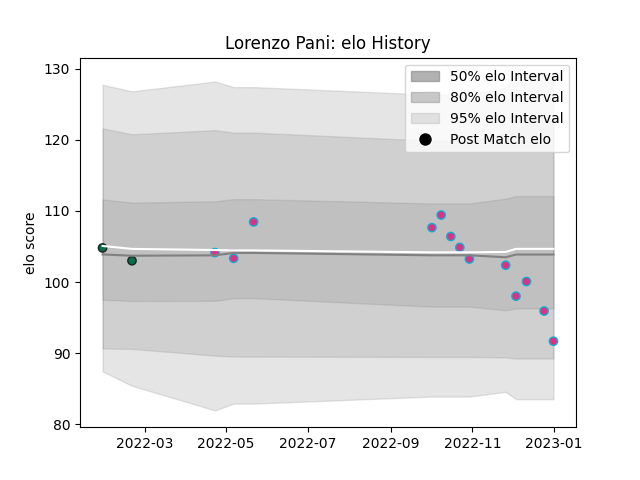

---  
layout: page  
title: Lorenzo Pani  
date: 2022-12-18 16:39:40.451591  
categories: player  
---
# Lorenzo Pani

## Positions: FB, W

## Current elo: 95.0

## Current Percentile: 54.0

# Elo History

# Match History

| Team             |   Appearances |   Win Rate |
|:-----------------|--------------:|-----------:|
| Zebre            |            11 |       0    |
| Benetton Treviso |             2 |       0.25 |

| Opponent         |   Matches |   Win Rate |
|:-----------------|----------:|-----------:|
| Dragons          |         2 |       0.25 |
| Edinburgh        |         2 |       0    |
| Glasgow Warriors |         2 |       0    |
| Cardiff Blues    |         1 |       0    |
| Connacht         |         1 |       0    |
| Munster          |         1 |       0    |
| Scarlets         |         1 |       0    |
| Stormers         |         1 |       0    |
| Toulon           |         1 |       0    |
| Ulster           |         1 |       0    |