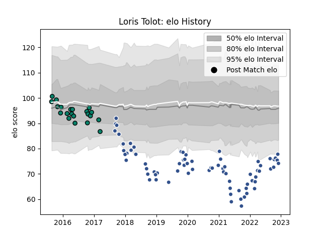

---  
layout: page  
title: Loris Tolot  
date: 2023-01-13 11:36:48.827129  
categories: player  
---
# Loris Tolot

## Positions: FB, W

## Current elo: 65.0

## Current Percentile: 2.0

# Elo History

# Match History

| Team      |   Appearances |   Win Rate |
|:----------|--------------:|-----------:|
| Agen      |            79 |   0.240506 |
| Montauban |            23 |   0.565217 |

| Opponent             |   Matches |   Win Rate |
|:---------------------|----------:|-----------:|
| Racing 92            |         7 |   0.214286 |
| Pau                  |         7 |   0.142857 |
| Clermont Auvergne    |         5 |   0        |
| Bayonne              |         5 |   0.3      |
| Carcassonne          |         5 |   0.6      |
| Oyonnax              |         4 |   0        |
| La Rochelle          |         4 |   0        |
| Montpellier Herault  |         4 |   0.5      |
| Colomiers            |         4 |   0.5      |
| Vannes               |         3 |   1        |
| Dax                  |         3 |   0.333333 |
| Grenoble             |         3 |   0.333333 |
| Bordeaux Begles      |         3 |   0        |
| Beziers              |         3 |   0.333333 |
| Mont-de-Marsan       |         3 |   0.333333 |
| Aurillac             |         2 |   0.5      |
| Perpignan            |         2 |   0.5      |
| Tarbes               |         2 |   0.5      |
| Provence Rugby       |         2 |   0.5      |
| Toulon               |         2 |   0        |
| Rouen                |         2 |   0.5      |
| Lyon                 |         2 |   0        |
| Stade Francais Paris |         2 |   0.5      |
| Gloucester Rugby     |         2 |   0        |
| Castres Olympique    |         2 |   0        |
| Brive                |         2 |   0.5      |
| Bourgoin-Jallieu     |         2 |   0.5      |
| Biarritz Olympique   |         2 |   1        |
| Wasps                |         2 |   0        |
| US Bressane          |         1 |   0        |
| Stade Toulousain     |         1 |   0        |
| Albi                 |         1 |   1        |
| Massy                |         1 |   1        |
| Nevers               |         1 |   1        |
| Narbonne             |         1 |   1        |
| Montauban            |         1 |   0        |
| Harlequins           |         1 |   0        |
| Edinburgh            |         1 |   0        |
| Benetton Treviso     |         1 |   0        |
| Zebre                |         1 |   0        |