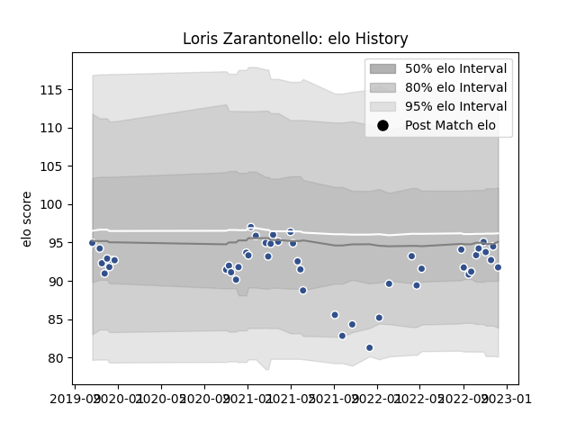

---  
layout: page  
title: Loris Zarantonello  
date: 2023-02-04 18:32:43.619328  
categories: player  
---
# Loris Zarantonello

## Positions: H

## Current elo: 107.0

## Current Percentile: 80.0

# Elo History

# Match History

| Team   |   Appearances |   Win Rate |
|:-------|--------------:|-----------:|
| Agen   |            63 |   0.246032 |

| Opponent             |   Matches |   Win Rate |
|:---------------------|----------:|-----------:|
| Bordeaux Begles      |         5 |   0        |
| Bayonne              |         3 |   0.166667 |
| Vannes               |         3 |   0.666667 |
| Stade Toulousain     |         3 |   0        |
| Provence Rugby       |         3 |   0.666667 |
| Colomiers            |         3 |   0.333333 |
| Oyonnax              |         3 |   0        |
| Grenoble             |         3 |   0.333333 |
| Aurillac             |         2 |   1        |
| Toulon               |         2 |   0        |
| Stade Francais Paris |         2 |   0.5      |
| Rouen                |         2 |   1        |
| Racing 92            |         2 |   0        |
| Nevers               |         2 |   0.5      |
| Narbonne             |         2 |   0.5      |
| Montauban            |         2 |   0.5      |
| Lyon                 |         2 |   0        |
| Clermont Auvergne    |         2 |   0        |
| Castres Olympique    |         2 |   0        |
| Brive                |         2 |   0        |
| Beziers              |         2 |   0        |
| Mont-de-Marsan       |         1 |   0        |
| Montpellier Herault  |         1 |   0        |
| La Rochelle          |         1 |   0        |
| Edinburgh            |         1 |   0        |
| Pau                  |         1 |   0        |
| Carcassonne          |         1 |   0        |
| Soyaux-Angouleme     |         1 |   0        |
| Biarritz Olympique   |         1 |   1        |
| US Bressane          |         1 |   0        |
| Benetton Treviso     |         1 |   0        |
| Wasps                |         1 |   0        |