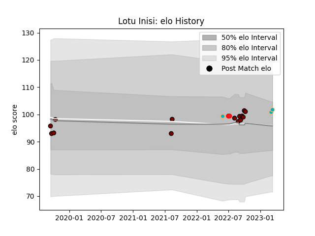

---  
layout: page  
title: Lotu Inisi  
date: 2023-03-17 17:27:37.223217  
categories: player  
---
# Lotu Inisi

## Positions: N8

## Country: Tonga

## Current elo: 102.0

## Current Percentile: 67.0

# Elo History

# Match History

| Team           |   Appearances |   Win Rate |
|:---------------|--------------:|-----------:|
| North Harbour  |            14 |   0.428571 |
| Moana Pasifika |             3 |   0.333333 |
| Tonga          |             2 |   0        |

| Opponent         |   Matches |   Win Rate |
|:-----------------|----------:|-----------:|
| Auckland         |         2 |          0 |
| Counties Manukau |         2 |          1 |
| Otago            |         1 |          0 |
| Wellington       |         1 |          1 |
| Waikato          |         1 |          0 |
| Tasman           |         1 |          0 |
| Taranaki         |         1 |          1 |
| Southland        |         1 |          1 |
| Samoa            |         1 |          0 |
| Northland        |         1 |          1 |
| Bay of Plenty    |         1 |          0 |
| Hawke's Bay      |         1 |          0 |
| Fiji             |         1 |          0 |
| Chiefs           |         1 |          0 |
| Canterbury       |         1 |          0 |
| Brumbies         |         1 |          1 |
| Western Force    |         1 |          0 |