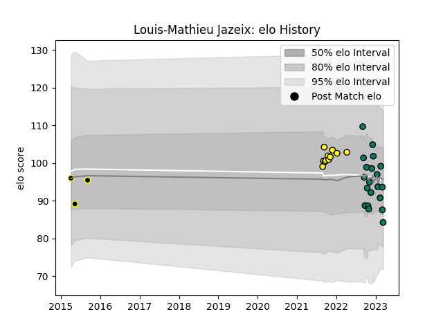

---  
layout: page  
title: Louis-Mathieu Jazeix  
date: 2022-12-14 11:19:45.852260  
categories: player  
---
# Louis-Mathieu Jazeix

## Positions: FL, N8

## Current elo: 88.0

## Current Percentile: 27.0

# Elo History

# Match History

| Team           |   Appearances |   Win Rate |
|:---------------|--------------:|-----------:|
| Suresnes       |            13 |   0.538462 |
| Carcassonne    |             3 |   0.333333 |
| Mont-de-Marsan |             2 |   0        |

| Opponent                   |   Matches |   Win Rate |
|:---------------------------|----------:|-----------:|
| Albi                       |         1 |          1 |
| Beziers                    |         1 |          0 |
| US Bressane                |         1 |          0 |
| Tarbes                     |         1 |          1 |
| Rouen                      |         1 |          1 |
| Rennes                     |         1 |          1 |
| Perpignan                  |         1 |          0 |
| Oyonnax                    |         1 |          0 |
| Nice                       |         1 |          0 |
| Narbonne                   |         1 |          0 |
| Mont-de-Marsan             |         1 |          0 |
| Dax                        |         1 |          0 |
| Cognac Saint Jean d'Angély |         1 |          1 |
| Chambery                   |         1 |          1 |
| Carqueiranne-Hyères        |         1 |          1 |
| Bourgoin-Jallieu           |         1 |          1 |
| Blagnac                    |         1 |          0 |
| Valence Romans Drome Rugby |         1 |          0 |