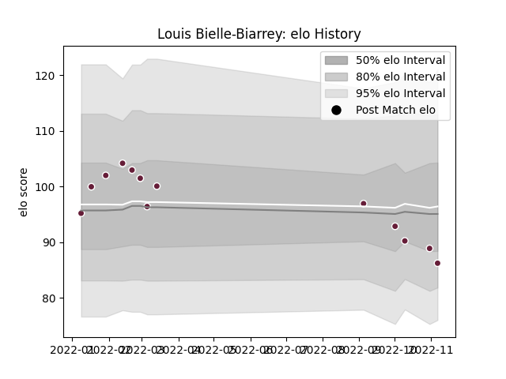

---  
layout: page  
title: Louis Bielle-Biarrey  
date: 2022-11-16 11:31:25.880522  
categories: player  
---
# Louis Bielle-Biarrey

## Positions: FB, W

## Current elo: 86.0

## Current Percentile: 24.0

# Elo History

# Match History

| Team            |   Appearances |   Win Rate |
|:----------------|--------------:|-----------:|
| Bordeaux Begles |            13 |   0.384615 |

| Opponent             |   Matches |   Win Rate |
|:---------------------|----------:|-----------:|
| Pau                  |         2 |        0   |
| Stade Toulousain     |         2 |        0   |
| Toulon               |         2 |        0.5 |
| Brive                |         1 |        1   |
| Castres Olympique    |         1 |        1   |
| Clermont Auvergne    |         1 |        0   |
| Lyon                 |         1 |        0   |
| Racing 92            |         1 |        0   |
| Scarlets             |         1 |        1   |
| Stade Francais Paris |         1 |        1   |