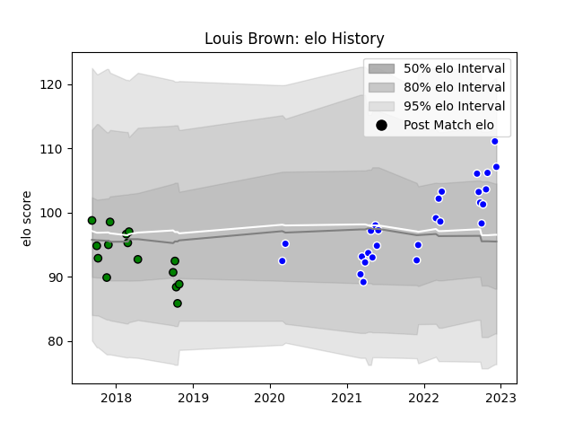

---  
layout: page  
title: Louis Brown  
date: 2022-12-14 11:11:26.379545  
categories: player  
---
# Louis Brown

## Positions: FB, W

## Current elo: 107.0

## Current Percentile: 85.0

# Elo History

# Match History

| Team               |   Appearances |   Win Rate |
|:-------------------|--------------:|-----------:|
| Coventry           |            27 |   0.62963  |
| Yorkshire Carnegie |            15 |   0.333333 |

| Opponent            |   Matches |   Win Rate |
|:--------------------|----------:|-----------:|
| Bedford             |         6 |   0.666667 |
| Jersey              |         5 |   0.4      |
| Cornish Pirates     |         4 |   0.5      |
| London Scottish     |         4 |   0.5      |
| Richmond            |         4 |   0.75     |
| Doncaster           |         3 |   0.666667 |
| Ealing Trailfinders |         3 |   0        |
| Ampthill            |         2 |   1        |
| Hartpury College    |         2 |   0.5      |
| Nottingham          |         2 |   1        |
| Rotherham Titans    |         2 |   0.5      |
| Bristol Rugby       |         1 |   0        |
| Caldy               |         1 |   1        |
| Coventry            |         1 |   0        |
| London Irish        |         1 |   0        |
| Saracens            |         1 |   0        |