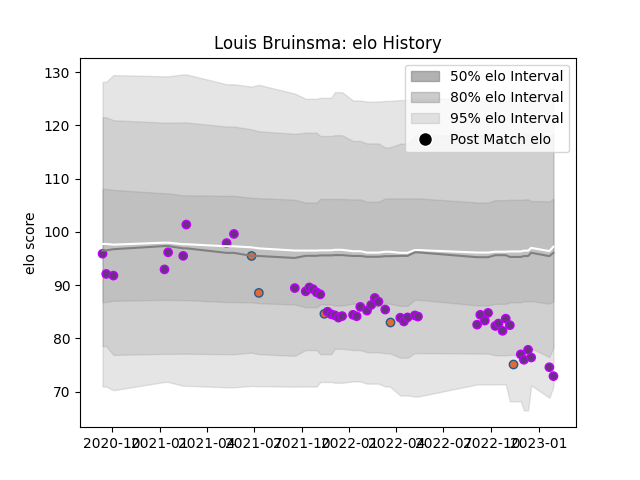

---  
layout: page  
title: Louis Bruinsma  
date: 2022-12-18 16:21:52.376826  
categories: player  
---
# Louis Bruinsma

## Positions: L

## Country: Netherlands

## Current elo: 95.0

## Current Percentile: 50.0

# Elo History

# Match History

| Team        |   Appearances |   Win Rate |
|:------------|--------------:|-----------:|
| US Bressane |            31 |   0.564516 |
| Netherlands |             5 |   0        |

| Opponent                   |   Matches |   Win Rate |
|:---------------------------|----------:|-----------:|
| Agen                       |         2 |        1   |
| Chambery                   |         2 |        1   |
| Romania                    |         2 |        0   |
| Narbonne                   |         2 |        0.5 |
| Dax                        |         2 |        0   |
| Vannes                     |         2 |        0   |
| Aurillac                   |         2 |        0.5 |
| Blagnac                    |         2 |        1   |
| Canada                     |         1 |        0   |
| Nevers                     |         1 |        0   |
| Valence Romans Drome Rugby |         1 |        1   |
| Tarbes                     |         1 |        1   |
| Suresnes                   |         1 |        1   |
| Rennes                     |         1 |        1   |
| Provence Rugby             |         1 |        0   |
| Portugal                   |         1 |        0   |
| Nice                       |         1 |        1   |
| Bayonne                    |         1 |        0   |
| Carcassonne                |         1 |        0   |
| Montauban                  |         1 |        0.5 |
| Mont-de-Marsan             |         1 |        0   |
| Albi                       |         1 |        0   |
| Dijon                      |         1 |        1   |
| Colomiers                  |         1 |        0   |
| Cognac Saint Jean d'Angély |         1 |        1   |
| Bourgoin-Jallieu           |         1 |        1   |
| Carqueiranne-Hyères        |         1 |        1   |
| Georgia                    |         1 |        0   |