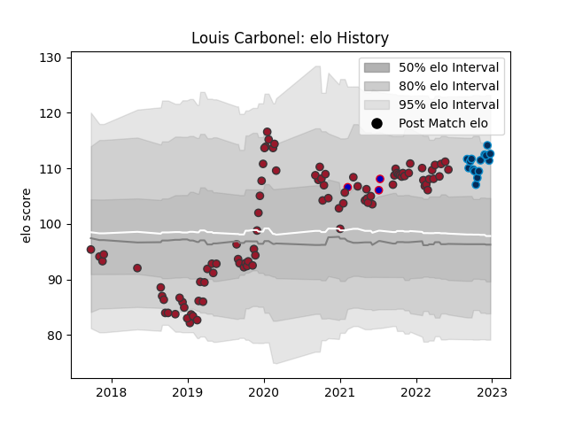

---  
layout: page  
title: Louis Carbonel  
date: 2022-12-14 11:29:31.977063  
categories: player  
---
# Louis Carbonel

## Positions: FH

## Country: France

## Current elo: 105.0

## Current Percentile: 75.0

# Elo History

# Match History

| Team                |   Appearances |   Win Rate |
|:--------------------|--------------:|-----------:|
| Toulon              |            89 |   0.55618  |
| Montpellier Herault |            13 |   0.538462 |
| France              |             3 |   0.666667 |

| Opponent             |   Matches |   Win Rate |
|:---------------------|----------:|-----------:|
| Stade Francais Paris |         8 |   0.75     |
| Castres Olympique    |         8 |   0.375    |
| Bordeaux Begles      |         8 |   0.625    |
| Stade Toulousain     |         8 |   0.4375   |
| Clermont Auvergne    |         8 |   0.5      |
| Racing 92            |         7 |   0.285714 |
| Lyon                 |         7 |   0.285714 |
| Pau                  |         7 |   0.642857 |
| La Rochelle          |         6 |   0.166667 |
| Montpellier Herault  |         6 |   0.416667 |
| Brive                |         5 |   0.8      |
| Perpignan            |         4 |   0.75     |
| Agen                 |         4 |   0.5      |
| Scarlets             |         3 |   1        |
| London Irish         |         3 |   1        |
| Bayonne              |         3 |   1        |
| Australia            |         2 |   0.5      |
| Biarritz Olympique   |         2 |   1        |
| Leicester Tigers     |         1 |   1        |
| Newcastle Falcons    |         1 |   1        |
| Italy                |         1 |   1        |
| Edinburgh            |         1 |   0        |
| Bristol Rugby        |         1 |   0        |
| Toulon               |         1 |   1        |