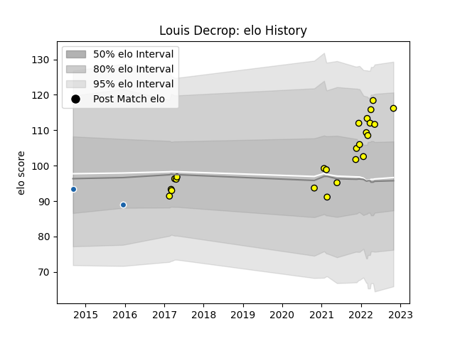

---  
layout: page  
title: Louis Decrop  
date: 2023-02-24 02:29:30.851887  
categories: player  
---
# Louis Decrop

## Positions: W

## Current elo: 116.0

## Current Percentile: 81.0

# Elo History

# Match History

| Team              |   Appearances |   Win Rate |
|:------------------|--------------:|-----------:|
| Albi              |            24 |   0.708333 |
| Castres Olympique |             2 |   0        |

| Opponent                   |   Matches |   Win Rate |
|:---------------------------|----------:|-----------:|
| Bourgoin-Jallieu           |         4 |       0.75 |
| Dax                        |         4 |       1    |
| Aubenas                    |         2 |       1    |
| Blagnac                    |         2 |       1    |
| Suresnes                   |         2 |       0.5  |
| Tarbes                     |         2 |       0.5  |
| Agen                       |         1 |       1    |
| Aurillac                   |         1 |       0    |
| Beziers                    |         1 |       1    |
| Chambery                   |         1 |       1    |
| Cognac Saint Jean d'Angély |         1 |       0    |
| Massy                      |         1 |       0    |
| Montpellier Herault        |         1 |       0    |
| Nice                       |         1 |       0    |
| Perpignan                  |         1 |       1    |
| Sale Sharks                |         1 |       0    |