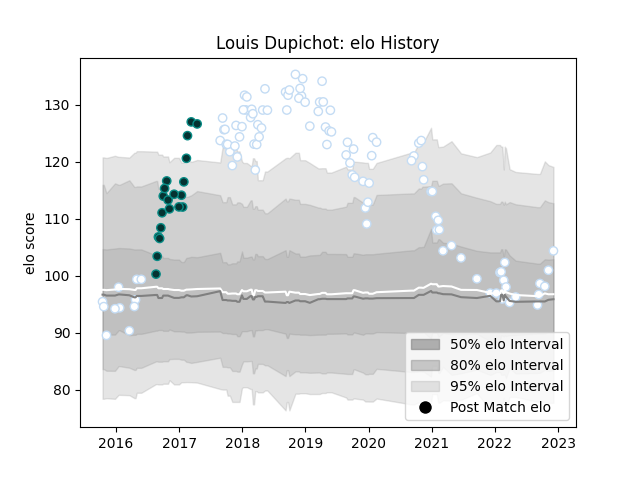

---  
layout: page  
title: Louis Dupichot  
date: 2022-12-09 13:14:57.530318  
categories: player  
---
# Louis Dupichot

## Positions: W, FB

## Current elo: 104.0

## Current Percentile: 70.0

# Elo History

# Match History

| Team      |   Appearances |   Win Rate |
|:----------|--------------:|-----------:|
| Racing 92 |           106 |   0.641509 |
| Pau       |            20 |   0.45     |

| Opponent             |   Matches |   Win Rate |
|:---------------------|----------:|-----------:|
| Castres Olympique    |        14 |   0.642857 |
| Clermont Auvergne    |        11 |   0.863636 |
| La Rochelle          |         9 |   0.333333 |
| Montpellier Herault  |         9 |   0.666667 |
| Lyon                 |         9 |   0.555556 |
| Bordeaux Begles      |         8 |   0.375    |
| Stade Toulousain     |         7 |   0.428571 |
| Stade Francais Paris |         7 |   0.571429 |
| Pau                  |         7 |   0.714286 |
| Toulon               |         6 |   0.5      |
| Brive                |         5 |   1        |
| Agen                 |         4 |   0.875    |
| Grenoble             |         4 |   1        |
| Leicester Tigers     |         4 |   1        |
| Munster              |         3 |   0.666667 |
| Oyonnax              |         3 |   1        |
| Perpignan            |         3 |   0.666667 |
| Bayonne              |         3 |   0.333333 |
| Cardiff Blues        |         2 |   0        |
| Bath Rugby           |         1 |   0        |
| Leinster             |         1 |   0        |
| Glasgow Warriors     |         1 |   0        |
| Exeter Chiefs        |         1 |   0        |
| Ospreys              |         1 |   1        |
| Saracens             |         1 |   0        |
| Scarlets             |         1 |   1        |
| Biarritz Olympique   |         1 |   0        |