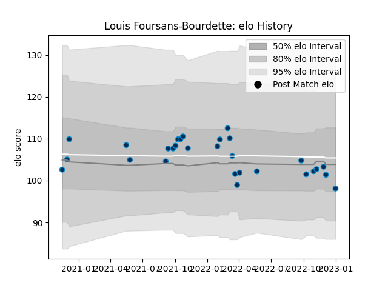

---  
layout: page  
title: Louis Foursans-Bourdette  
date: 2022-12-12 15:08:56.021256  
categories: player  
---
# Louis Foursans-Bourdette

## Positions: FH

## Current elo: 88.0

## Current Percentile: 21.0

# Elo History

# Match History

| Team                |   Appearances |   Win Rate |
|:--------------------|--------------:|-----------:|
| Montpellier Herault |            28 |   0.589286 |

| Opponent             |   Matches |   Win Rate |
|:---------------------|----------:|-----------:|
| Stade Francais Paris |         4 |   0.75     |
| Bordeaux Begles      |         3 |   0        |
| Clermont Auvergne    |         3 |   0.333333 |
| Pau                  |         3 |   0.666667 |
| Toulon               |         3 |   0.833333 |
| Bayonne              |         2 |   0.5      |
| Castres Olympique    |         2 |   0        |
| La Rochelle          |         2 |   1        |
| Racing 92            |         2 |   1        |
| Biarritz Olympique   |         1 |   1        |
| Brive                |         1 |   1        |
| Perpignan            |         1 |   1        |
| Stade Toulousain     |         1 |   0        |