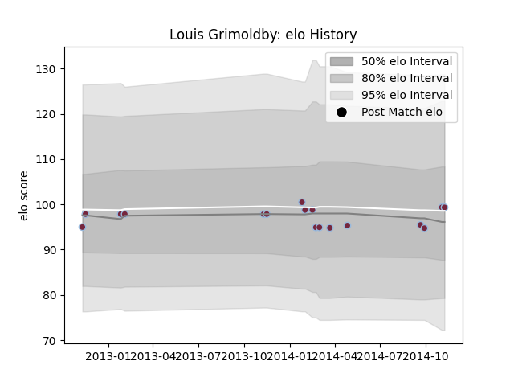

---  
layout: page  
title: Louis Grimoldby  
date: 2023-01-23 15:30:54.067653  
categories: player  
---
# Louis Grimoldby

## Positions: FH

## Current elo: 98.0

## Current Percentile: 50.0

# Elo History

# Match History

| Team       |   Appearances |   Win Rate |
|:-----------|--------------:|-----------:|
| Harlequins |            17 |   0.529412 |

| Opponent           |   Matches |   Win Rate |
|:-------------------|----------:|-----------:|
| Exeter Chiefs      |         2 |        0   |
| Northampton Saints |         2 |        0.5 |
| Saracens           |         2 |        0   |
| Bath Rugby         |         1 |        1   |
| Cardiff Blues      |         1 |        0   |
| Dragons            |         1 |        1   |
| Gloucester Rugby   |         1 |        0   |
| Leicester Tigers   |         1 |        1   |
| London Welsh       |         1 |        1   |
| Newcastle Falcons  |         1 |        1   |
| Ospreys            |         1 |        1   |
| Sale Sharks        |         1 |        0   |
| Wasps              |         1 |        1   |
| Worcester Warriors |         1 |        1   |