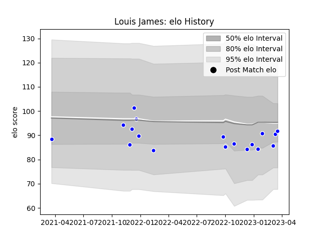

---  
layout: page  
title: Louis James  
date: 2022-12-18 16:17:02.138012  
categories: player  
---
# Louis James

## Positions: W

## Current elo: 82.0

## Current Percentile: 8.0

# Elo History

# Match History

| Team     |   Appearances |   Win Rate |
|:---------|--------------:|-----------:|
| Coventry |            12 |   0.416667 |

| Opponent            |   Matches |   Win Rate |
|:--------------------|----------:|-----------:|
| Ampthill            |         2 |        1   |
| Ealing Trailfinders |         2 |        0   |
| Nottingham          |         2 |        0.5 |
| Bedford             |         1 |        1   |
| Caldy               |         1 |        1   |
| Doncaster           |         1 |        0   |
| Hartpury College    |         1 |        0   |
| Jersey              |         1 |        0   |
| London Scottish     |         1 |        0   |