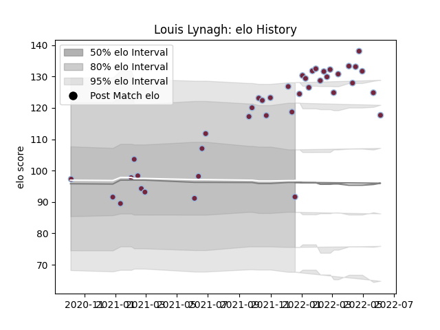

---  
layout: page  
title: Louis Lynagh  
date: 2023-03-27 11:36:38.139798  
categories: player  
---
# Louis Lynagh

Last updated: 2023-03-27
## Positions: W

## Current elo: 92.0

## Current Percentile: 87.0

# Elo History

# Match History

| Team       |   Appearances |   Win Rate |
|:-----------|--------------:|-----------:|
| Harlequins |            40 |     0.6875 |

| Opponent            |   Matches |   Win Rate |
|:--------------------|----------:|-----------:|
| Bristol Rugby       |         4 |   0.75     |
| Leicester Tigers    |         4 |   0.75     |
| Newcastle Falcons   |         4 |   0.75     |
| Sale Sharks         |         4 |   0.25     |
| Bath Rugby          |         3 |   0.666667 |
| Exeter Chiefs       |         3 |   0.666667 |
| Cardiff Blues       |         2 |   1        |
| Castres Olympique   |         2 |   1        |
| Gloucester Rugby    |         2 |   1        |
| London Irish        |         2 |   0.75     |
| Montpellier Herault |         2 |   0.5      |
| Northampton Saints  |         2 |   0.5      |
| Saracens            |         2 |   0        |
| Wasps               |         2 |   1        |
| Worcester Warriors  |         2 |   1        |