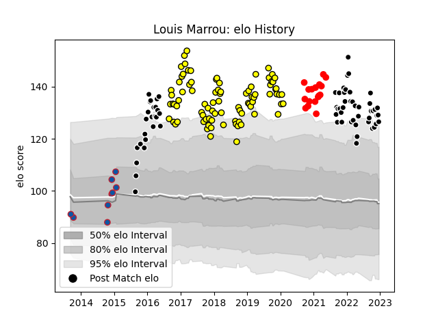

---  
layout: page  
title: Louis Marrou  
date: 2022-12-14 11:26:36.740249  
categories: player  
---
# Louis Marrou

## Positions: C

## Current elo: 113.0

## Current Percentile: 91.0

# Elo History

# Match History

| Team           |   Appearances |   Win Rate |
|:---------------|--------------:|-----------:|
| Carcassonne    |            69 |   0.507246 |
| Provence Rugby |            58 |   0.5      |
| Rouen          |            14 |   0.285714 |
| Grenoble       |             1 |   0        |

| Opponent                   |   Matches |   Win Rate |
|:---------------------------|----------:|-----------:|
| Montauban                  |        10 |   0.4      |
| Vannes                     |         9 |   0.555556 |
| Perpignan                  |         9 |   0.333333 |
| Oyonnax                    |         9 |   0.388889 |
| Colomiers                  |         8 |   0.125    |
| Mont-de-Marsan             |         8 |   0.5      |
| Biarritz Olympique         |         8 |   0.375    |
| Aurillac                   |         8 |   0.625    |
| Soyaux-Angouleme           |         7 |   0.642857 |
| Beziers                    |         7 |   0.571429 |
| Narbonne                   |         7 |   0.285714 |
| Nevers                     |         6 |   0.833333 |
| Bayonne                    |         6 |   0.666667 |
| Grenoble                   |         6 |   0.666667 |
| Dax                        |         5 |   0.6      |
| Carcassonne                |         5 |   0.6      |
| US Bressane                |         4 |   0.875    |
| Bourgoin-Jallieu           |         4 |   0.75     |
| Massy                      |         4 |   0.25     |
| Rouen                      |         3 |   0.333333 |
| Albi                       |         2 |   0.25     |
| Tarbes                     |         2 |   0.5      |
| Agen                       |         2 |   0        |
| Provence Rugby             |         1 |   0        |
| Lyon                       |         1 |   0        |
| Valence Romans Drome Rugby |         1 |   0        |