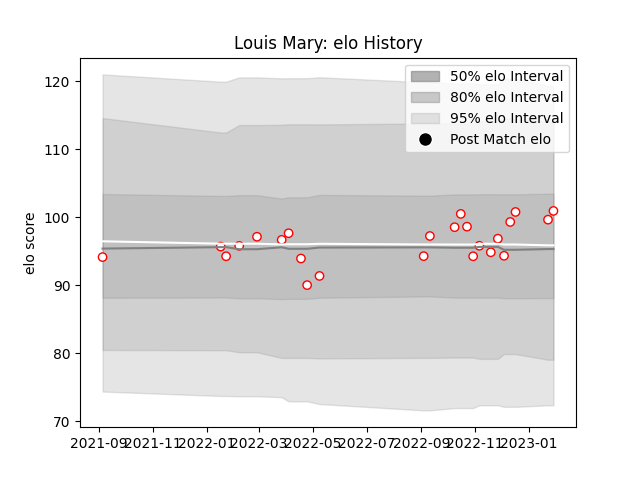

---  
layout: page  
title: Louis Mary  
date: 2022-12-09 13:12:06.933169  
categories: player  
---
# Louis Mary

## Positions: P

## Current elo: 99.0

## Current Percentile: 42.0

# Elo History

# Match History

| Team   |   Appearances |   Win Rate |
|:-------|--------------:|-----------:|
| Dax    |            12 |       0.75 |

| Opponent                   |   Matches |   Win Rate |
|:---------------------------|----------:|-----------:|
| Cognac Saint Jean d'Angély |         2 |        0.5 |
| Nice                       |         2 |        0.5 |
| Albi                       |         1 |        0   |
| Blagnac                    |         1 |        1   |
| Carqueiranne-Hyères        |         1 |        1   |
| Rennes                     |         1 |        1   |
| Suresnes                   |         1 |        1   |
| Tarbes                     |         1 |        1   |
| US Bressane                |         1 |        1   |
| Valence Romans Drome Rugby |         1 |        1   |