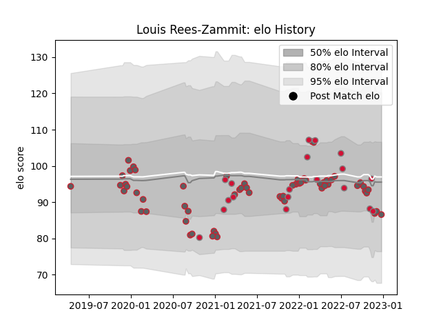

---  
layout: page  
title: Louis Rees-Zammit  
date: 2022-11-15 23:45:16.204163  
categories: player  
---
# Louis Rees-Zammit

## Positions: W

## Country: Wales

## Current elo: 102.0

## Current Percentile: 60.0

# Elo History

# Match History

| Team             |   Appearances |   Win Rate |
|:-----------------|--------------:|-----------:|
| Gloucester Rugby |            52 |   0.471154 |
| Wales            |            18 |   0.5      |

| Opponent            |   Matches |   Win Rate |
|:--------------------|----------:|-----------:|
| Bath Rugby          |         6 |   0.666667 |
| Bristol Rugby       |         6 |   0.333333 |
| Exeter Chiefs       |         5 |   0.4      |
| London Irish        |         5 |   0.7      |
| Harlequins          |         4 |   0        |
| Saracens            |         4 |   0.5      |
| Newcastle Falcons   |         4 |   0.75     |
| South Africa        |         4 |   0.25     |
| Northampton Saints  |         3 |   0.666667 |
| Sale Sharks         |         3 |   0.333333 |
| France              |         3 |   0        |
| Wasps               |         3 |   0.333333 |
| Ireland             |         2 |   0.5      |
| Italy               |         2 |   0.5      |
| Stade Toulousain    |         2 |   0        |
| Montpellier Herault |         2 |   0.5      |
| Scotland            |         2 |   1        |
| Connacht            |         2 |   0.5      |
| Worcester Warriors  |         2 |   1        |
| Argentina           |         1 |   1        |
| New Zealand         |         1 |   0        |
| Australia           |         1 |   1        |
| Fiji                |         1 |   1        |
| England             |         1 |   1        |
| Leicester Tigers    |         1 |   0        |