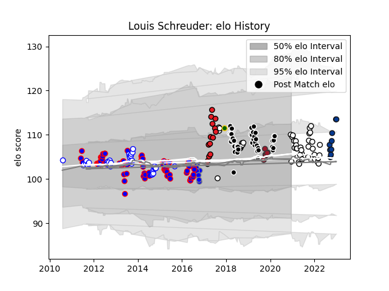

---  
layout: page  
title: Louis Schreuder  
date: 2023-02-02 19:05:56.343753  
categories: player  
---
# Louis Schreuder

## Positions: SH

## Country: South Africa

## Current elo: 100.0

## Current Percentile: 75.0

# Elo History

# Match History

| Team                              |   Appearances |   Win Rate |
|:----------------------------------|--------------:|-----------:|
| Stormers                          |            74 |   0.621622 |
| Sharks                            |            40 |   0.525    |
| Western Province                  |            40 |   0.7375   |
| Newcastle Falcons                 |            34 |   0.338235 |
| Southern Kings                    |            14 |   0.428571 |
| Bath Rugby                        |            12 |   0.208333 |
| Natal Sharks                      |            11 |   0.909091 |
| Kubota Spears Funabashi Tokyo-Bay |             8 |   0.4375   |
| Toulon                            |             7 |   0.642857 |
| South Africa                      |             1 |   0        |

| Opponent                         |   Matches |   Win Rate |
|:---------------------------------|----------:|-----------:|
| Bulls                            |        13 |   0.615385 |
| Lions                            |        12 |   0.625    |
| Sharks                           |        10 |   0.4      |
| Cheetahs                         |        10 |   0.6      |
| Melbourne Rebels                 |         9 |   0.777778 |
| Griquas                          |         9 |   0.944444 |
| Free State Cheetahs              |         9 |   0.777778 |
| Golden Lions                     |         9 |   0.611111 |
| New South Wales Waratahs         |         8 |   0.5625   |
| Jaguares                         |         8 |   0.5      |
| Blue Bulls                       |         7 |   0.785714 |
| Brumbies                         |         7 |   0.285714 |
| Hurricanes                       |         7 |   0.428571 |
| Queensland Reds                  |         7 |   0.571429 |
| Natal Sharks                     |         6 |   0.5      |
| Pumas                            |         6 |   1        |
| Crusaders                        |         5 |   0.1      |
| Stormers                         |         5 |   0.6      |
| Sunwolves                        |         5 |   0.9      |
| Chiefs                           |         5 |   0.2      |
| Wasps                            |         5 |   0.4      |
| Blues                            |         5 |   0.8      |
| Highlanders                      |         5 |   0.8      |
| London Irish                     |         4 |   0.25     |
| Harlequins                       |         4 |   0.25     |
| Exeter Chiefs                    |         4 |   0.25     |
| Western Force                    |         4 |   0.75     |
| Bristol Rugby                    |         4 |   0.25     |
| Gloucester Rugby                 |         4 |   0.25     |
| Saracens                         |         3 |   0        |
| Sale Sharks                      |         3 |   0        |
| Southern Kings                   |         3 |   1        |
| Northampton Saints               |         3 |   0.666667 |
| Bath Rugby                       |         3 |   0.333333 |
| Worcester Warriors               |         3 |   0.833333 |
| Western Province                 |         2 |   0.5      |
| Bayonne                          |         2 |   1        |
| Leicester Tigers                 |         2 |   0        |
| Eastern Province Kings           |         2 |   1        |
| Glasgow Warriors                 |         1 |   0.5      |
| Brive                            |         1 |   0        |
| Cardiff Blues                    |         1 |   0        |
| Wales                            |         1 |   0        |
| Toyota Verblitz                  |         1 |   0        |
| Toyota Industries Shuttles Aichi |         1 |   1        |
| Toulon                           |         1 |   0        |
| Toshiba Brave Lupus Tokyo        |         1 |   0        |
| Munakata Sanix Blues             |         1 |   1        |
| Montpellier Herault              |         1 |   0.5      |
| Green Rockets Tokatsu            |         1 |   0.5      |
| Shizuoka Blue Revs               |         1 |   0        |
| Hanazono Kintetsu Liners         |         1 |   0        |
| La Rochelle                      |         1 |   1        |
| Racing 92                        |         1 |   1        |
| Leopards                         |         1 |   1        |
| Mie Honda Heat                   |         1 |   1        |
| Newcastle Falcons                |         1 |   1        |
| Stade Francais Paris             |         1 |   0        |