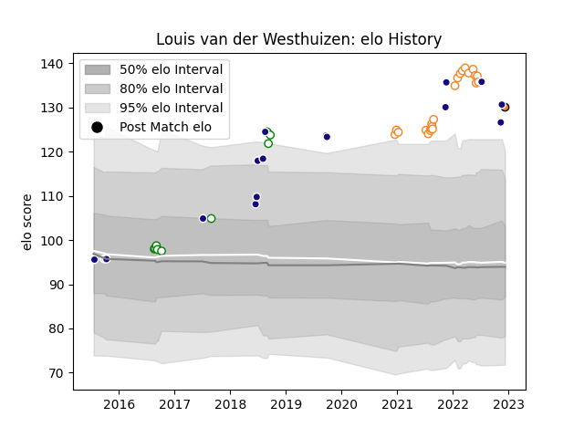

---  
layout: page  
title: Louis van der Westhuizen  
date: 2023-03-17 17:06:12.068710  
categories: player  
---
# Louis van der Westhuizen

## Positions: H

## Country: Namibia

## Current elo: 130.0

## Current Percentile: 97.0

# Elo History

# Match History

| Team                |   Appearances |   Win Rate |
|:--------------------|--------------:|-----------:|
| Free State Cheetahs |            22 |   0.613636 |
| Namibia             |            19 |   0.631579 |
| Leopards            |            10 |   0.85     |
| Cheetahs            |             1 |   1        |

| Opponent               |   Matches |   Win Rate |
|:-----------------------|----------:|-----------:|
| Pumas                  |         6 |   0.5      |
| Natal Sharks           |         5 |   0.6      |
| Griquas                |         4 |   0.75     |
| SWD Eagles             |         3 |   0.833333 |
| Blue Bulls             |         3 |   0.666667 |
| Kenya                  |         3 |   1        |
| Zimbabwe               |         3 |   1        |
| Golden Lions           |         2 |   0.75     |
| Western Province       |         2 |   0.5      |
| Tunisia                |         2 |   1        |
| Griffons               |         2 |   0.5      |
| Russia                 |         1 |   1        |
| Valke                  |         1 |   1        |
| Uganda                 |         1 |   1        |
| Tonga                  |         1 |   0        |
| Spain                  |         1 |   0        |
| South Africa           |         1 |   0        |
| Boland Cavaliers       |         1 |   1        |
| Border Bulldogs        |         1 |   1        |
| Pau                    |         1 |   1        |
| New Zealand            |         1 |   0        |
| Canada                 |         1 |   1        |
| Namibia Welwitchias    |         1 |   1        |
| Morocco                |         1 |   1        |
| Eastern Province Kings |         1 |   1        |
| Italy                  |         1 |   0        |
| Georgia                |         1 |   0        |
| Argentina              |         1 |   0        |