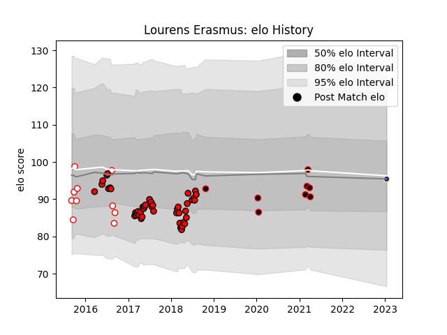

---  
layout: page  
title: Lourens Erasmus  
date: 2023-01-15 11:47:19.769182  
categories: player  
---
# Lourens Erasmus

## Positions: L, FL

## Current elo: 95.0

## Current Percentile: None

# Elo History

# Match History

| Team                            |   Appearances |   Win Rate |
|:--------------------------------|--------------:|-----------:|
| Lions                           |            45 |   0.733333 |
| Golden Lions                    |            10 |   0.8      |
| NTT Docomo Red Hurricanes Osaka |             8 |   0.625    |
| Urayasu D-Rocks                 |             1 |   1        |

| Opponent                         |   Matches |   Win Rate |
|:---------------------------------|----------:|-----------:|
| Jaguares                         |         7 |   0.571429 |
| Sharks                           |         6 |   0.833333 |
| Bulls                            |         4 |   1        |
| Hurricanes                       |         3 |   0.333333 |
| Western Province                 |         3 |   1        |
| New South Wales Waratahs         |         3 |   1        |
| Crusaders                        |         3 |   0        |
| Southern Kings                   |         3 |   1        |
| Stormers                         |         3 |   1        |
| Highlanders                      |         2 |   0.5      |
| Sunwolves                        |         2 |   1        |
| Queensland Reds                  |         2 |   0.5      |
| Free State Cheetahs              |         2 |   1        |
| Cheetahs                         |         2 |   1        |
| Brumbies                         |         2 |   1        |
| Toshiba Brave Lupus Tokyo        |         1 |   0        |
| Saitama Wild Knights             |         1 |   0        |
| Toyota Industries Shuttles Aichi |         1 |   1        |
| Western Force                    |         1 |   1        |
| Shizuoka Blue Revs               |         1 |   0        |
| Black Rams Tokyo                 |         1 |   1        |
| Mitsubishi Dynaboars             |         1 |   1        |
| Pumas                            |         1 |   1        |
| Natal Sharks                     |         1 |   1        |
| Blue Bulls                       |         1 |   0        |
| Melbourne Rebels                 |         1 |   1        |
| Kyuden Voltex                    |         1 |   1        |
| Hino Red Dolphins                |         1 |   1        |
| Griquas                          |         1 |   0        |
| Eastern Province Kings           |         1 |   1        |
| Blues                            |         1 |   0        |
| Yokohama Canon Eagles            |         1 |   1        |