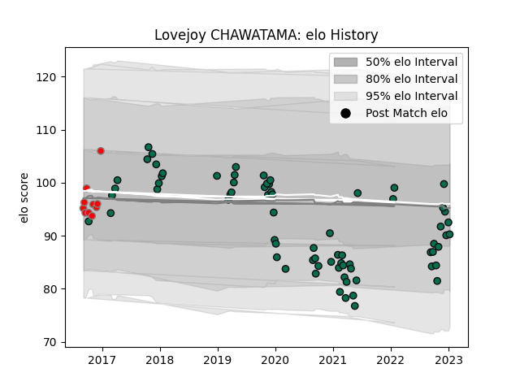

---  
layout: page  
title: Lovejoy CHAWATAMA  
date: 2023-01-06 11:52:03.499578  
categories: player  
---
# Lovejoy CHAWATAMA

## Positions: P

## Current elo: 93.0

## Current Percentile: 31.0

# Elo History

# Match History

| Team         |   Appearances |   Win Rate |
|:-------------|--------------:|-----------:|
| London Irish |            70 |   0.414286 |
| London Welsh |            10 |   0.5      |

| Opponent             |   Matches |   Win Rate |
|:---------------------|----------:|-----------:|
| Gloucester Rugby     |         5 |   0.2      |
| Worcester Warriors   |         5 |   0.4      |
| Exeter Chiefs        |         5 |   0.2      |
| Sale Sharks          |         4 |   0        |
| Leicester Tigers     |         4 |   0.25     |
| Harlequins           |         3 |   0        |
| London Scottish      |         3 |   1        |
| Wasps                |         3 |   0.666667 |
| Newcastle Falcons    |         3 |   0.666667 |
| Yorkshire Carnegie   |         3 |   0.333333 |
| Edinburgh            |         3 |   0.333333 |
| Bristol Rugby        |         3 |   0.333333 |
| Bath Rugby           |         3 |   0.666667 |
| Toulon               |         2 |   0        |
| Northampton Saints   |         2 |   0        |
| Stade Francais Paris |         2 |   0.5      |
| Richmond             |         2 |   1        |
| Rotherham Titans     |         2 |   0.5      |
| Krasny Yar           |         2 |   1        |
| Hartpury College     |         2 |   1        |
| Ealing Trailfinders  |         2 |   0.5      |
| Doncaster            |         2 |   1        |
| Cornish Pirates      |         2 |   0.5      |
| Bayonne              |         2 |   0.5      |
| Saracens             |         2 |   0        |
| Scarlets             |         1 |   0        |
| Stormers             |         1 |   0        |
| Agen                 |         1 |   1        |
| Pau                  |         1 |   1        |
| Nottingham           |         1 |   1        |
| Montpellier Herault  |         1 |   0        |
| London Irish         |         1 |   0        |
| Jersey               |         1 |   0        |
| London Welsh         |         1 |   1        |