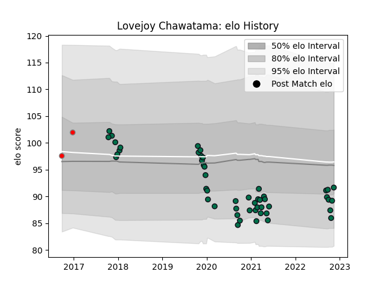

---  
layout: page  
title: Lovejoy Chawatama  
date: 2022-12-09 13:05:49.722968  
categories: player  
---
# Lovejoy Chawatama

## Positions: P

## Current elo: 97.0

## Current Percentile: 46.0

# Elo History

# Match History

| Team         |   Appearances |   Win Rate |
|:-------------|--------------:|-----------:|
| London Irish |            52 |   0.346154 |
| London Welsh |             2 |   0.5      |

| Opponent             |   Matches |   Win Rate |
|:---------------------|----------:|-----------:|
| Worcester Warriors   |         5 |   0.4      |
| Exeter Chiefs        |         5 |   0.2      |
| Gloucester Rugby     |         4 |   0.25     |
| Sale Sharks          |         4 |   0        |
| Leicester Tigers     |         4 |   0.25     |
| Newcastle Falcons    |         3 |   0.666667 |
| Bath Rugby           |         3 |   0.666667 |
| Harlequins           |         3 |   0        |
| Bristol Rugby        |         3 |   0.333333 |
| Krasny Yar           |         2 |   1        |
| Edinburgh            |         2 |   0        |
| Wasps                |         2 |   1        |
| Northampton Saints   |         2 |   0        |
| Toulon               |         2 |   0        |
| Bayonne              |         2 |   0.5      |
| Stade Francais Paris |         2 |   0.5      |
| Scarlets             |         1 |   0        |
| Agen                 |         1 |   1        |
| Saracens             |         1 |   0        |
| Pau                  |         1 |   1        |
| Cornish Pirates      |         1 |   0        |
| London Scottish      |         1 |   1        |