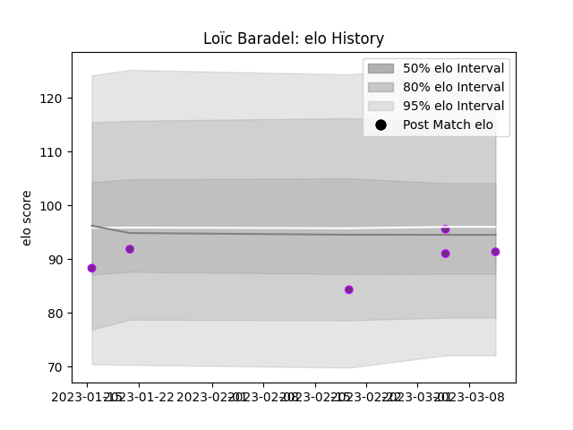

---  
layout: page  
title: Loïc Baradel  
date: 2023-03-17 17:29:52.052310  
categories: player  
---
# Loïc Baradel

## Positions: FL, N8

## Current elo: 91.0

## Current Percentile: 38.0

# Elo History

# Match History

| Team        |   Appearances |   Win Rate |
|:------------|--------------:|-----------:|
| US Bressane |             6 |        0.5 |

| Opponent                   |   Matches |   Win Rate |
|:---------------------------|----------:|-----------:|
| Narbonne                   |         2 |          1 |
| Carqueiranne-Hyères        |         1 |          0 |
| Chambery                   |         1 |          0 |
| Cognac Saint Jean d'Angély |         1 |          1 |
| Nice                       |         1 |          0 |