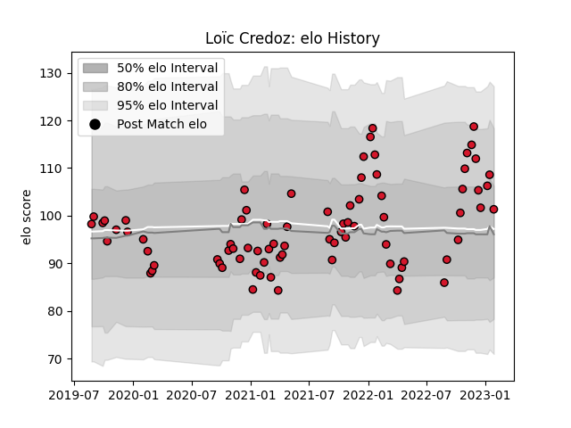

---  
layout: page  
title: Loïc Credoz  
date: 2023-03-21 18:24:35.005687  
categories: player  
---
# Loïc Credoz

Last updated: 2023-03-21
## Positions: FL, N8

## Current elo: 106.0

## Current Percentile: 81.0

# Elo History

# Match History

| Team    |   Appearances |   Win Rate |
|:--------|--------------:|-----------:|
| Oyonnax |            84 |   0.690476 |

| Opponent                   |   Matches |   Win Rate |
|:---------------------------|----------:|-----------:|
| Beziers                    |         8 |   0.8125   |
| Colomiers                  |         8 |   0.5      |
| Montauban                  |         6 |   0.5      |
| Rouen                      |         6 |   0.5      |
| Nevers                     |         6 |   0.833333 |
| Carcassonne                |         6 |   1        |
| Mont-de-Marsan             |         5 |   0.6      |
| Aurillac                   |         5 |   0.6      |
| Vannes                     |         5 |   0.6      |
| Grenoble                   |         5 |   0.6      |
| Biarritz Olympique         |         4 |   0.5      |
| Provence Rugby             |         4 |   0.875    |
| Soyaux-Angouleme           |         3 |   1        |
| Narbonne                   |         2 |   1        |
| Perpignan                  |         2 |   0        |
| Bayonne                    |         2 |   0.5      |
| US Bressane                |         2 |   1        |
| Agen                       |         2 |   1        |
| Massy                      |         1 |   1        |
| Roval Drome XV             |         1 |   1        |
| Valence Romans Drome Rugby |         1 |   1        |