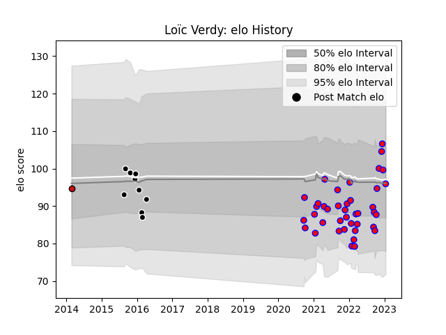

---  
layout: page  
title: Loïc Verdy  
date: 2023-01-17 11:28:44.168522  
categories: player  
---
# Loïc Verdy

## Positions: FL, N8

## Current elo: 96.0

## Current Percentile: 61.0

# Elo History

# Match History

| Team             |   Appearances |   Win Rate |
|:-----------------|--------------:|-----------:|
| Blagnac          |            40 |   0.525    |
| Provence Rugby   |             9 |   0.222222 |
| Stade Toulousain |             1 |   0        |

| Opponent                   |   Matches |   Win Rate |
|:---------------------------|----------:|-----------:|
| Cognac Saint Jean d'Angély |         5 |   0.6      |
| Albi                       |         4 |   0.25     |
| Tarbes                     |         4 |   0.5      |
| Suresnes                   |         4 |   0.5      |
| Massy                      |         4 |   0.5      |
| Dax                        |         4 |   0.25     |
| Bourgoin-Jallieu           |         4 |   0.5      |
| Chambery                   |         3 |   1        |
| Valence Romans Drome Rugby |         3 |   0.666667 |
| Nice                       |         2 |   0.5      |
| Soyaux-Angouleme           |         2 |   0        |
| US Bressane                |         2 |   0        |
| Castres Olympique          |         1 |   0        |
| Carqueiranne-Hyères        |         1 |   1        |
| Colomiers                  |         1 |   0        |
| Aubenas                    |         1 |   1        |
| Lyon                       |         1 |   0        |
| Montauban                  |         1 |   1        |
| Narbonne                   |         1 |   0        |
| Beziers                    |         1 |   0        |
| Bayonne                    |         1 |   1        |