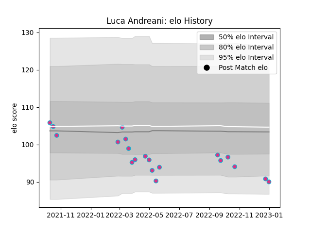

---  
layout: page  
title: Luca Andreani  
date: 2023-02-02 18:56:01.085687  
categories: player  
---
# Luca Andreani

## Positions: FL

## Current elo: 80.0

## Current Percentile: 9.0

# Elo History

# Match History

| Team   |   Appearances |   Win Rate |
|:-------|--------------:|-----------:|
| Zebre  |            22 |  0.0454545 |

| Opponent         |   Matches |   Win Rate |
|:-----------------|----------:|-----------:|
| Benetton Treviso |         3 |          0 |
| Edinburgh        |         3 |          0 |
| Glasgow Warriors |         2 |          0 |
| Leinster         |         2 |          0 |
| Ospreys          |         2 |          0 |
| Sharks           |         2 |          0 |
| Stormers         |         2 |          0 |
| Bulls            |         1 |          0 |
| Cardiff Blues    |         1 |          0 |
| Connacht         |         1 |          0 |
| Dragons          |         1 |          1 |
| Scarlets         |         1 |          0 |
| Toulon           |         1 |          0 |