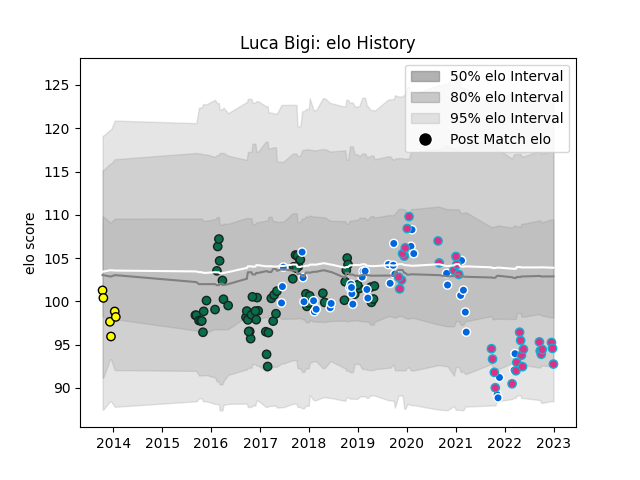

---  
layout: page  
title: Luca Bigi  
date: 2023-01-06 00:13:21.059406  
categories: player  
---
# Luca Bigi

## Positions: H

## Country: Italy

## Current elo: 93.0

## Current Percentile: 15.0

# Elo History

# Match History

| Team             |   Appearances |   Win Rate |
|:-----------------|--------------:|-----------:|
| Benetton Treviso |            63 |  0.309524  |
| Italy            |            41 |  0.219512  |
| Zebre            |            33 |  0.227273  |
| Arix Viadana     |             6 |  0.0833333 |

| Opponent             |   Matches |   Win Rate |
|:---------------------|----------:|-----------:|
| Benetton Treviso     |         8 |      0.375 |
| Munster              |         8 |      0     |
| Edinburgh            |         8 |      0.125 |
| Glasgow Warriors     |         7 |      0     |
| Ulster               |         6 |      0     |
| Scarlets             |         6 |      0     |
| Leinster             |         6 |      0.25  |
| Ireland              |         5 |      0     |
| Dragons              |         5 |      0.8   |
| Scotland             |         5 |      0     |
| Ospreys              |         5 |      0.4   |
| France               |         5 |      0     |
| Zebre                |         5 |      0.8   |
| Cardiff Blues        |         5 |      0.2   |
| Connacht             |         4 |      0     |
| England              |         4 |      0     |
| Wales                |         4 |      0.25  |
| Bayonne              |         4 |      0.5   |
| Grenoble             |         3 |      0.5   |
| Brive                |         2 |      0.5   |
| Wasps                |         2 |      0     |
| Australia            |         2 |      0     |
| Toulon               |         2 |      0     |
| Southern Kings       |         2 |      1     |
| South Africa         |         2 |      0     |
| New Zealand          |         2 |      0     |
| Cheetahs             |         2 |      1     |
| Agen                 |         2 |      0.5   |
| Fiji                 |         2 |      0.5   |
| Georgia              |         2 |      1     |
| Japan                |         2 |      0.5   |
| Argentina            |         2 |      0     |
| Lions                |         1 |      0     |
| Stade Francais Paris |         1 |      0     |
| Uruguay              |         1 |      1     |
| Canada               |         1 |      1     |
| Gloucester Rugby     |         1 |      0     |
| Stormers             |         1 |      0     |
| Harlequins           |         1 |      1     |
| Bulls                |         1 |      0     |
| Sharks               |         1 |      0     |
| Bath Rugby           |         1 |      0     |
| Russia               |         1 |      1     |
| Bristol Rugby        |         1 |      0.5   |
| La Rochelle          |         1 |      0     |
| Namibia              |         1 |      1     |