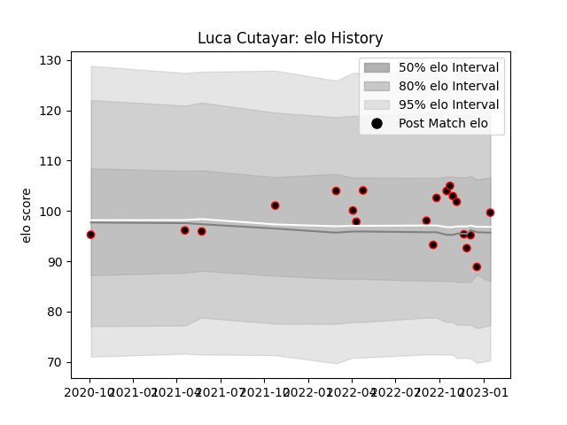

---  
layout: page  
title: Luca Cutayar  
date: 2022-12-14 11:14:16.664791  
categories: player  
---
# Luca Cutayar

## Positions: C

## Current elo: 91.0

## Current Percentile: 27.0

# Elo History

# Match History

| Team   |   Appearances |   Win Rate |
|:-------|--------------:|-----------:|
| Nice   |            13 |   0.461538 |

| Opponent                   |   Matches |   Win Rate |
|:---------------------------|----------:|-----------:|
| Chambery                   |         2 |        0   |
| Cognac Saint Jean d'Angély |         2 |        0.5 |
| Blagnac                    |         1 |        1   |
| Bourgoin-Jallieu           |         1 |        0   |
| Dijon                      |         1 |        1   |
| Narbonne                   |         1 |        0   |
| Rennes                     |         1 |        1   |
| Suresnes                   |         1 |        1   |
| Tarbes                     |         1 |        1   |
| US Bressane                |         1 |        0   |
| Valence Romans Drome Rugby |         1 |        0   |