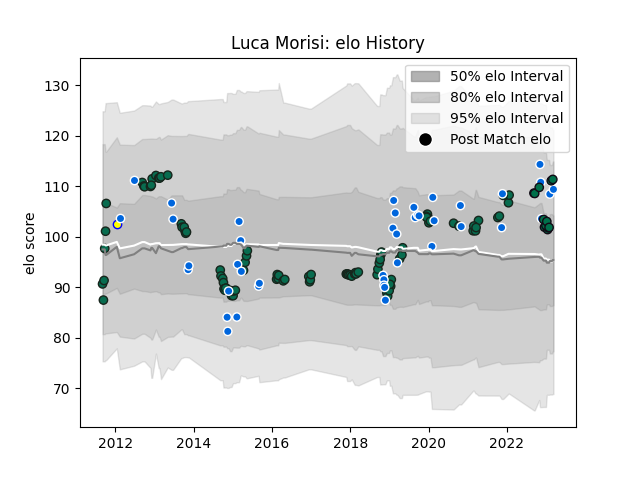

---  
layout: page  
title: Luca Morisi  
date: 2022-12-18 16:13:52.783618  
categories: player  
---
# Luca Morisi

## Positions: C

## Country: Italy

## Current elo: 117.0

## Current Percentile: 94.0

# Elo History

# Match History

| Team             |   Appearances |   Win Rate |
|:-----------------|--------------:|-----------:|
| Benetton Treviso |            91 |   0.351648 |
| Italy            |            39 |   0.25641  |
| London Irish     |             7 |   0.285714 |
| Crociati Rugby   |             1 |   0        |

| Opponent                 |   Matches |   Win Rate |
|:-------------------------|----------:|-----------:|
| Scarlets                 |        12 |  0.333333  |
| Zebre                    |         8 |  0.875     |
| Glasgow Warriors         |         7 |  0.428571  |
| Ospreys                  |         7 |  0.142857  |
| Cardiff Blues            |         6 |  0.333333  |
| Connacht                 |         6 |  0.333333  |
| Munster                  |         6 |  0         |
| Leinster                 |         6 |  0.0833333 |
| Ulster                   |         6 |  0.25      |
| Scotland                 |         5 |  0.2       |
| Dragons                  |         5 |  0.6       |
| Wales                    |         4 |  0         |
| France                   |         4 |  0         |
| England                  |         4 |  0         |
| Ireland                  |         4 |  0         |
| South Africa             |         4 |  0         |
| Northampton Saints       |         3 |  0         |
| Harlequins               |         3 |  0.333333  |
| Leicester Tigers         |         3 |  0         |
| Edinburgh                |         3 |  0         |
| Australia                |         3 |  0.333333  |
| Worcester Warriors       |         2 |  0.5       |
| Samoa                    |         2 |  1         |
| Agen                     |         2 |  0.5       |
| Bayonne                  |         2 |  1         |
| Argentina                |         2 |  0         |
| Montpellier Herault      |         2 |  0         |
| Lyon                     |         2 |  0.5       |
| Grenoble                 |         2 |  1         |
| Newcastle Falcons        |         1 |  1         |
| Toulon                   |         1 |  0         |
| Fiji                     |         1 |  1         |
| Uruguay                  |         1 |  1         |
| United States of America |         1 |  1         |
| Georgia                  |         1 |  1         |
| Stade Toulousain         |         1 |  0         |
| Stormers                 |         1 |  0         |
| New Zealand              |         1 |  0         |
| Southern Kings           |         1 |  1         |
| Russia                   |         1 |  1         |
| Racing 92                |         1 |  0         |
| Namibia                  |         1 |  1         |