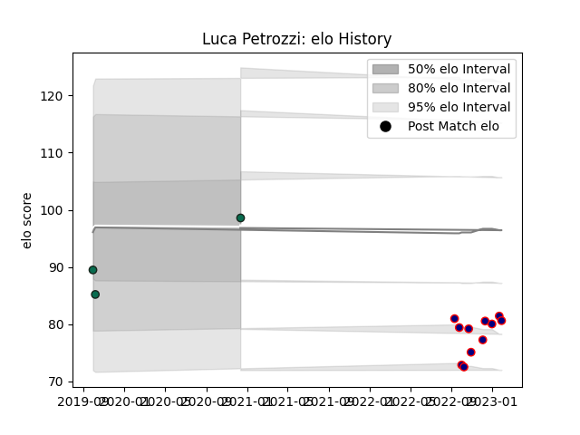

---  
layout: page  
title: Luca Petrozzi  
date: 2023-01-06 00:15:39.379805  
categories: player  
---
# Luca Petrozzi

## Positions: SH

## Current elo: 106.0

## Current Percentile: None

# Elo History

# Match History

| Team             |   Appearances |   Win Rate |
|:-----------------|--------------:|-----------:|
| London Scottish  |             9 |   0.111111 |
| Benetton Treviso |             3 |   0.333333 |

| Opponent             |   Matches |   Win Rate |
|:---------------------|----------:|-----------:|
| Ampthill             |         1 |          0 |
| Caldy                |         1 |          1 |
| Connacht             |         1 |          0 |
| Cornish Pirates      |         1 |          0 |
| Coventry             |         1 |          0 |
| Doncaster            |         1 |          0 |
| Ealing Trailfinders  |         1 |          0 |
| Jersey               |         1 |          0 |
| Leinster             |         1 |          0 |
| Nottingham           |         1 |          0 |
| Richmond             |         1 |          0 |
| Stade Francais Paris |         1 |          1 |