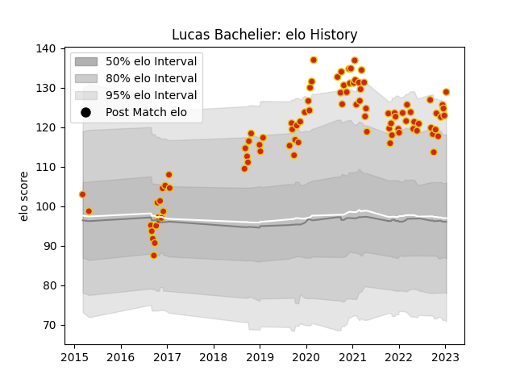

---  
layout: page  
title: Lucas Bachelier  
date: 2023-02-02 18:53:06.986896  
categories: player  
---
# Lucas Bachelier

## Positions: FL

## Current elo: 135.0

## Current Percentile: 96.0

# Elo History

# Match History

| Team      |   Appearances |   Win Rate |
|:----------|--------------:|-----------:|
| Perpignan |            92 |   0.472826 |

| Opponent                   |   Matches |   Win Rate |
|:---------------------------|----------:|-----------:|
| Aurillac                   |         5 |   0.5      |
| Beziers                    |         5 |   0.8      |
| Mont-de-Marsan             |         5 |   0.8      |
| Clermont Auvergne          |         5 |   0.2      |
| Montpellier Herault        |         4 |   0        |
| Bordeaux Begles            |         4 |   0.625    |
| Stade Francais Paris       |         4 |   0.25     |
| Soyaux-Angouleme           |         4 |   0.875    |
| Oyonnax                    |         4 |   0.75     |
| Carcassonne                |         4 |   0.5      |
| Colomiers                  |         4 |   0.5      |
| Grenoble                   |         3 |   0.333333 |
| Montauban                  |         3 |   0.666667 |
| Pau                        |         3 |   0        |
| Castres Olympique          |         3 |   0.333333 |
| Racing 92                  |         3 |   0.333333 |
| Biarritz Olympique         |         3 |   0.333333 |
| Provence Rugby             |         2 |   1        |
| Nevers                     |         2 |   0.5      |
| Rouen                      |         2 |   0.5      |
| Valence Romans Drome Rugby |         2 |   1        |
| Agen                       |         2 |   0        |
| La Rochelle                |         2 |   0.5      |
| Lyon                       |         2 |   0        |
| Brive                      |         2 |   0.5      |
| Narbonne                   |         1 |   1        |
| Albi                       |         1 |   1        |
| Glasgow Warriors           |         1 |   0        |
| Dax                        |         1 |   0        |
| Bristol Rugby              |         1 |   0        |
| Bourgoin-Jallieu           |         1 |   1        |
| Stade Toulousain           |         1 |   0        |
| Toulon                     |         1 |   1        |
| Bayonne                    |         1 |   0        |
| Vannes                     |         1 |   0        |