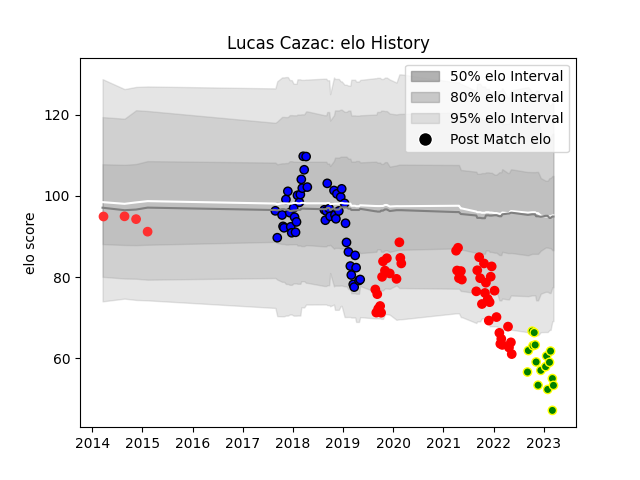

---  
layout: page  
title: Lucas Cazac  
date: 2023-01-15 12:02:47.061264  
categories: player  
---
# Lucas Cazac

## Positions: L

## Current elo: 56.0

## Current Percentile: 1.0

# Elo History

# Match History

| Team                |   Appearances |   Win Rate |
|:--------------------|--------------:|-----------:|
| Massy               |            48 |   0.302083 |
| Rouen               |            44 |   0.318182 |
| Carqueiranne-Hyères |            11 |   0.363636 |
| Tarbes              |             4 |   0.5      |

| Opponent                   |   Matches |   Win Rate |
|:---------------------------|----------:|-----------:|
| Aurillac                   |         8 |   0.25     |
| Beziers                    |         7 |   0.285714 |
| Mont-de-Marsan             |         6 |   0.166667 |
| Carcassonne                |         6 |   0.5      |
| Soyaux-Angouleme           |         6 |   0.25     |
| Nevers                     |         6 |   0.166667 |
| Colomiers                  |         6 |   0.333333 |
| Vannes                     |         6 |   0.333333 |
| Bayonne                    |         6 |   0        |
| Montauban                  |         5 |   0        |
| Biarritz Olympique         |         5 |   0.4      |
| Oyonnax                    |         5 |   0.4      |
| Perpignan                  |         5 |   0.6      |
| Grenoble                   |         4 |   0.25     |
| Provence Rugby             |         4 |   0.75     |
| US Bressane                |         3 |   0        |
| Dax                        |         3 |   0.333333 |
| Narbonne                   |         3 |   0.666667 |
| Bourgoin-Jallieu           |         2 |   0        |
| Suresnes                   |         2 |   0.5      |
| Brive                      |         1 |   0        |
| Roval Drome XV             |         1 |   1        |
| Tarbes                     |         1 |   1        |
| Nice                       |         1 |   0        |
| Rennes                     |         1 |   0        |
| Chambery                   |         1 |   1        |
| Blagnac                    |         1 |   0        |
| Cognac Saint Jean d'Angély |         1 |   1        |
| Agen                       |         1 |   1        |