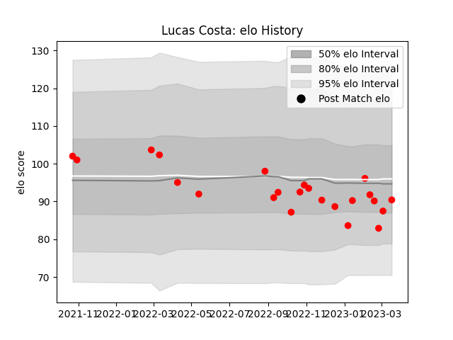

---  
layout: page  
title: Lucas Costa  
date: 2023-03-21 18:35:40.917103  
categories: player  
---
# Lucas Costa

Last updated: 2023-03-21
## Positions: FL

## Current elo: 90.0

## Current Percentile: 25.0

# Elo History

# Match History

| Team   |   Appearances |   Win Rate |
|:-------|--------------:|-----------:|
| Rouen  |            23 |   0.413043 |

| Opponent           |   Matches |   Win Rate |
|:-------------------|----------:|-----------:|
| Aurillac           |         3 |   0.333333 |
| Oyonnax            |         3 |   0.666667 |
| Agen               |         2 |   0        |
| Biarritz Olympique |         2 |   0.5      |
| Grenoble           |         2 |   0        |
| Massy              |         2 |   1        |
| Montauban          |         2 |   0        |
| Soyaux-Angouleme   |         2 |   1        |
| Bayonne            |         1 |   0        |
| Beziers            |         1 |   0        |
| Nevers             |         1 |   0        |
| Provence Rugby     |         1 |   0.5      |
| Vannes             |         1 |   1        |