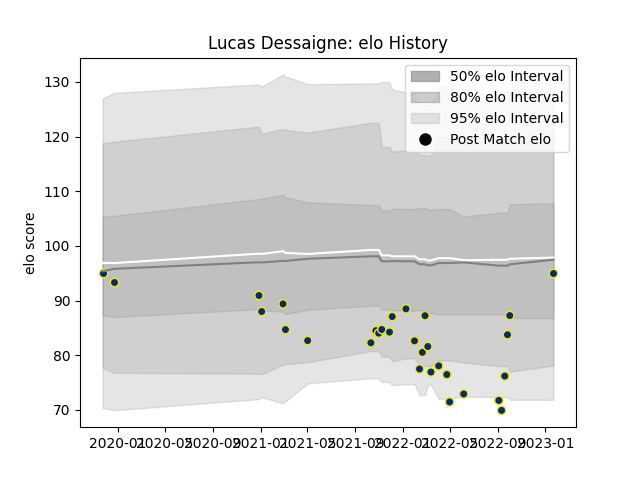

---  
layout: page  
title: Lucas Dessaigne  
date: 2023-01-23 15:33:36.511086  
categories: player  
---
# Lucas Dessaigne

## Positions: N8, FL

## Current elo: 95.0

## Current Percentile: 25.0

# Elo History

# Match History

| Team              |   Appearances |   Win Rate |
|:------------------|--------------:|-----------:|
| Clermont Auvergne |            30 |   0.466667 |

| Opponent             |   Matches |   Win Rate |
|:---------------------|----------:|-----------:|
| Toulon               |         4 |   0.25     |
| Brive                |         3 |   0.666667 |
| Pau                  |         3 |   0.666667 |
| Stade Francais Paris |         3 |   0.333333 |
| Bordeaux Begles      |         2 |   0.5      |
| La Rochelle          |         2 |   0.5      |
| Lyon                 |         2 |   1        |
| Montpellier Herault  |         2 |   0.5      |
| Perpignan            |         2 |   0.5      |
| Racing 92            |         2 |   0        |
| Agen                 |         1 |   1        |
| Biarritz Olympique   |         1 |   1        |
| Castres Olympique    |         1 |   0        |
| Stormers             |         1 |   0        |
| Ulster               |         1 |   0        |