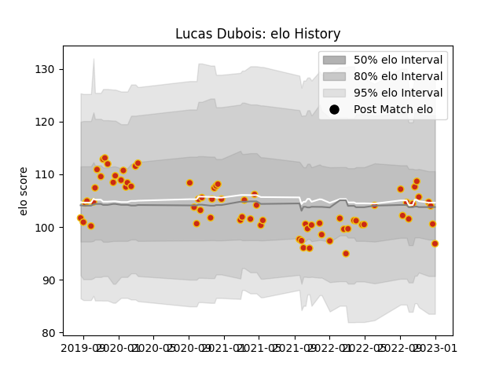

---  
layout: page  
title: Lucas Dubois  
date: 2022-12-18 16:16:31.284193  
categories: player  
---
# Lucas Dubois

## Positions: W, FB

## Current elo: 92.0

## Current Percentile: 29.0

# Elo History

# Match History

| Team      |   Appearances |   Win Rate |
|:----------|--------------:|-----------:|
| Perpignan |            57 |   0.552632 |

| Opponent                   |   Matches |   Win Rate |
|:---------------------------|----------:|-----------:|
| Aurillac                   |         4 |   0.875    |
| Rouen                      |         4 |   0.5      |
| Beziers                    |         3 |   0.666667 |
| Toulon                     |         3 |   0.666667 |
| Racing 92                  |         3 |   0.333333 |
| Pau                        |         3 |   0        |
| Clermont Auvergne          |         3 |   0.333333 |
| Mont-de-Marsan             |         3 |   0.666667 |
| La Rochelle                |         2 |   0.5      |
| Stade Francais Paris       |         2 |   0        |
| Nevers                     |         2 |   1        |
| Montpellier Herault        |         2 |   0        |
| Lyon                       |         2 |   0.5      |
| Grenoble                   |         2 |   1        |
| Colomiers                  |         2 |   0.5      |
| Brive                      |         2 |   0.5      |
| Bordeaux Begles            |         2 |   0.5      |
| Vannes                     |         2 |   1        |
| Bayonne                    |         1 |   0        |
| Glasgow Warriors           |         1 |   0        |
| Castres Olympique          |         1 |   1        |
| Carcassonne                |         1 |   1        |
| Provence Rugby             |         1 |   1        |
| Bristol Rugby              |         1 |   0        |
| Roval Drome XV             |         1 |   1        |
| Soyaux-Angouleme           |         1 |   1        |
| Stade Toulousain           |         1 |   1        |
| Biarritz Olympique         |         1 |   0        |
| Valence Romans Drome Rugby |         1 |   1        |