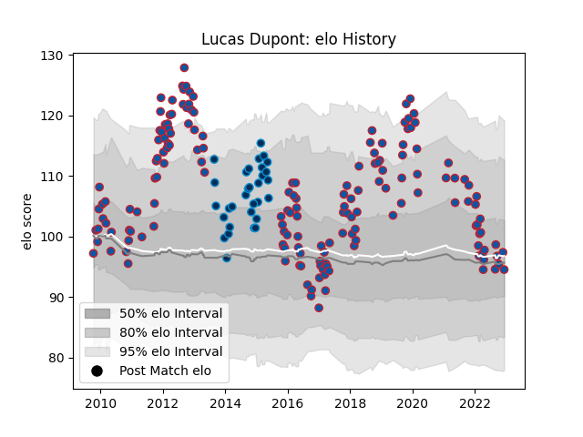

---  
layout: page  
title: Lucas Dupont  
date: 2023-03-21 18:31:48.220724  
categories: player  
---
# Lucas Dupont

Last updated: 2023-03-21
## Positions: W

## Current elo: 100.0

## Current Percentile: 45.0

# Elo History

# Match History

| Team                |   Appearances |   Win Rate |
|:--------------------|--------------:|-----------:|
| Grenoble            |           181 |   0.574586 |
| Montpellier Herault |            34 |   0.485294 |

| Opponent             |   Matches |   Win Rate |
|:---------------------|----------:|-----------:|
| Oyonnax              |        11 |   0.727273 |
| Stade Toulousain     |         9 |   0.444444 |
| Biarritz Olympique   |         9 |   0.388889 |
| Bordeaux Begles      |         9 |   0.5      |
| Pau                  |         8 |   0.375    |
| Toulon               |         8 |   0.4375   |
| Colomiers            |         8 |   0.375    |
| Aurillac             |         7 |   0.857143 |
| Bayonne              |         7 |   0.714286 |
| Beziers              |         7 |   0.714286 |
| La Rochelle          |         7 |   0.214286 |
| Castres Olympique    |         7 |   0.428571 |
| Nevers               |         6 |   0.583333 |
| Montauban            |         6 |   0.666667 |
| Narbonne             |         6 |   0.75     |
| Dax                  |         6 |   0.833333 |
| Agen                 |         6 |   0.583333 |
| Carcassonne          |         6 |   1        |
| Stade Francais Paris |         6 |   0.5      |
| Perpignan            |         5 |   0.4      |
| Mont-de-Marsan       |         5 |   0.6      |
| Lyon                 |         5 |   0.5      |
| Vannes               |         5 |   0.6      |
| Brive                |         4 |   0.25     |
| Auch                 |         4 |   0.75     |
| Montpellier Herault  |         4 |   0        |
| Provence Rugby       |         4 |   0.5      |
| Rouen                |         3 |   0.666667 |
| Albi                 |         3 |   0.5      |
| Harlequins           |         3 |   0.333333 |
| Racing 92            |         3 |   0.666667 |
| Benetton Treviso     |         3 |   0.333333 |
| Clermont Auvergne    |         3 |   0.333333 |
| Périgueux            |         2 |   1        |
| Soyaux-Angouleme     |         2 |   1        |
| London Irish         |         2 |   1        |
| Tarbes               |         2 |   1        |
| Grenoble             |         2 |   0.5      |
| Saint-Etienne        |         1 |   1        |
| Ulster               |         1 |   0        |
| Bath Rugby           |         1 |   0        |
| Lannemezan           |         1 |   1        |
| Roval Drome XV       |         1 |   1        |
| Leicester Tigers     |         1 |   0        |
| Newcastle Falcons    |         1 |   1        |
| Connacht             |         1 |   1        |
| Edinburgh            |         1 |   0        |
| Glasgow Warriors     |         1 |   0        |
| Massy                |         1 |   1        |
| Bourgoin-Jallieu     |         1 |   1        |