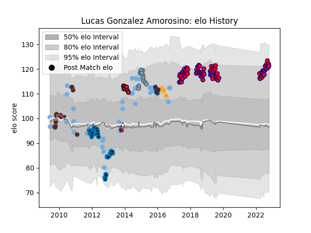

---  
layout: page  
title: Lucas Gonzalez Amorosino  
date: 2023-03-21 18:32:13.204690  
categories: player  
---
# Lucas Gonzalez Amorosino

Last updated: 2023-03-21
## Positions: FH, FB

## Country: Argentina

## Current elo: 121.0

## Current Percentile: 90.0

# Elo History

# Match History

| Team                |   Appearances |   Win Rate |
|:--------------------|--------------:|-----------:|
| Pucara              |            82 |   0.536585 |
| Argentina           |            52 |   0.298077 |
| Montpellier Herault |            35 |   0.557143 |
| Leicester Tigers    |            16 |   0.59375  |
| Cardiff Blues       |            12 |   0.333333 |
| Oyonnax             |            11 |   0.454545 |
| Jaguares            |             9 |   0.222222 |
| Munster             |             8 |   0.375    |

| Opponent                 |   Matches |   Win Rate |
|:-------------------------|----------:|-----------:|
| South Africa             |        10 |   0.25     |
| Australia                |        10 |   0.1      |
| SIC                      |         9 |   0.333333 |
| CUBA                     |         8 |   0.375    |
| CASI                     |         8 |   0.625    |
| New Zealand              |         8 |   0        |
| Alumni                   |         7 |   0.357143 |
| Regatas Bella Vista      |         7 |   0.642857 |
| Hindu                    |         7 |   0.285714 |
| Belgrano                 |         7 |   0.428571 |
| Newman                   |         7 |   0.785714 |
| Atlético del Rosario     |         6 |   0.75     |
| Biarritz Olympique       |         5 |   0.8      |
| France                   |         5 |   0.4      |
| Toulon                   |         4 |   0.25     |
| Castres Olympique        |         4 |   0        |
| Clermont Auvergne        |         4 |   0.25     |
| Scotland                 |         4 |   0.25     |
| Ireland                  |         4 |   0.25     |
| San Luis                 |         4 |   0.5      |
| La Plata                 |         4 |   0.5      |
| Leicester Tigers         |         3 |   0        |
| Leinster                 |         3 |   0.166667 |
| Newcastle Falcons        |         3 |   1        |
| Italy                    |         3 |   1        |
| Perpignan                |         3 |   0.666667 |
| Racing 92                |         3 |   0.666667 |
| Dragons                  |         3 |   0.333333 |
| England                  |         3 |   0.333333 |
| Stade Toulousain         |         3 |   0        |
| Benetton Treviso         |         3 |   0.666667 |
| Bayonne                  |         3 |   1        |
| Bath Rugby               |         3 |   0.333333 |
| Sale Sharks              |         2 |   1        |
| Munster                  |         2 |   0        |
| San Martin               |         2 |   1        |
| Sharks                   |         2 |   0        |
| Stade Francais Paris     |         2 |   1        |
| Ospreys                  |         2 |   0.25     |
| Northampton Saints       |         2 |   0.5      |
| Ulster                   |         2 |   0.5      |
| Agen                     |         2 |   0.5      |
| Lomas                    |         2 |   1        |
| Harlequins               |         2 |   0.5      |
| Grenoble                 |         2 |   0.5      |
| Mont-de-Marsan           |         2 |   1        |
| Buenos Aires             |         2 |   0.5      |
| Los Tilos                |         2 |   1        |
| Brive                    |         2 |   1        |
| Georgia                  |         2 |   1        |
| Stormers                 |         1 |   0        |
| Sunwolves                |         1 |   0        |
| Namibia                  |         1 |   1        |
| Bordeaux Begles          |         1 |   1        |
| Bulls                    |         1 |   1        |
| Arix Viadana             |         1 |   1        |
| Wales                    |         1 |   0        |
| Wasps                    |         1 |   1        |
| Worcester Warriors       |         1 |   1        |
| Southern Kings           |         1 |   1        |
| Scarlets                 |         1 |   1        |
| Casa Montepaschi Viadana |         1 |   1        |
| Connacht                 |         1 |   0        |
| Montpellier Herault      |         1 |   0        |
| Saracens                 |         1 |   0        |
| Crusaders                |         1 |   0        |
| Glasgow Warriors         |         1 |   0        |
| Romania                  |         1 |   1        |
| Highlanders              |         1 |   0        |
| Lions                    |         1 |   0        |
| London Irish             |         1 |   0        |
| Lyon                     |         1 |   1        |
| Yorkshire Carnegie       |         1 |   0        |