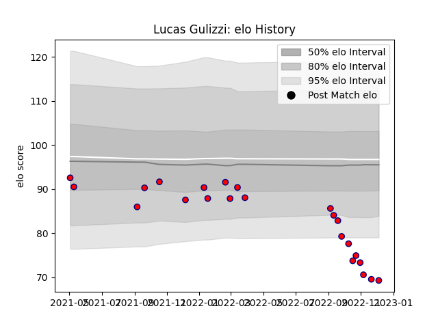

---  
layout: page  
title: Lucas Gulizzi  
date: 2022-12-14 11:18:49.974933  
categories: player  
---
# Lucas Gulizzi

## Positions: FL

## Current elo: 66.0

## Current Percentile: 1.0

# Elo History

# Match History

| Team                       |   Appearances |   Win Rate |
|:---------------------------|--------------:|-----------:|
| Cognac Saint Jean d'Angély |            24 |      0.125 |

| Opponent                   |   Matches |   Win Rate |
|:---------------------------|----------:|-----------:|
| Suresnes                   |         3 |        0   |
| Albi                       |         2 |        0   |
| Dax                        |         2 |        0.5 |
| Valence Romans Drome Rugby |         2 |        0   |
| Bourgoin-Jallieu           |         2 |        0   |
| Blagnac                    |         2 |        0.5 |
| Carqueiranne-Hyères        |         1 |        0   |
| Chambery                   |         1 |        0   |
| Dijon                      |         1 |        1   |
| Aubenas                    |         1 |        0   |
| Narbonne                   |         1 |        0   |
| Nice                       |         1 |        0   |
| Rennes                     |         1 |        0   |
| Soyaux-Angouleme           |         1 |        0   |
| Tarbes                     |         1 |        0   |
| US Bressane                |         1 |        0   |
| Massy                      |         1 |        0   |