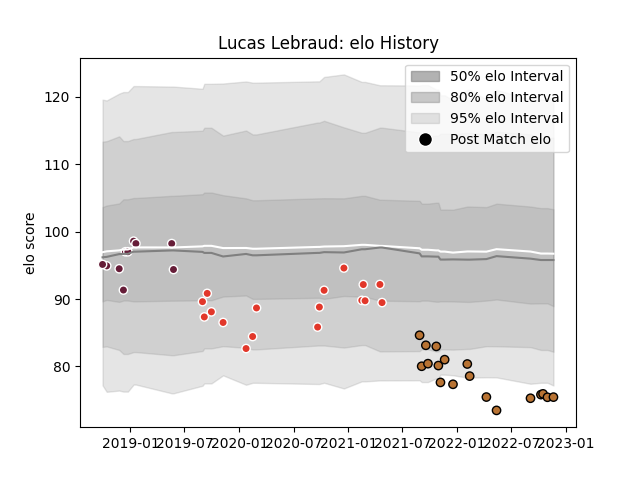

---  
layout: page  
title: Lucas Lebraud  
date: 2022-12-18 16:20:55.620018  
categories: player  
---
# Lucas Lebraud

## Positions: C

## Current elo: 74.0

## Current Percentile: 4.0

# Elo History

# Match History

| Team               |   Appearances |   Win Rate |
|:-------------------|--------------:|-----------:|
| Narbonne           |            19 |   0.184211 |
| Biarritz Olympique |            17 |   0.617647 |
| Bordeaux Begles    |            10 |   0.5      |

| Opponent                   |   Matches |   Win Rate |
|:---------------------------|----------:|-----------:|
| Vannes                     |         3 |   0.666667 |
| Grenoble                   |         3 |   0.833333 |
| Provence Rugby             |         3 |   1        |
| Oyonnax                    |         3 |   0.333333 |
| Sale Sharks                |         2 |   0.5      |
| Rouen                      |         2 |   0.5      |
| Bayonne                    |         2 |   0        |
| Mont-de-Marsan             |         2 |   0        |
| La Rochelle                |         2 |   0.5      |
| Aurillac                   |         2 |   0.5      |
| Colomiers                  |         2 |   0        |
| Carcassonne                |         2 |   0.5      |
| Connacht                   |         2 |   0        |
| Beziers                    |         2 |   0.5      |
| Dax                        |         1 |   0        |
| Soyaux-Angouleme           |         1 |   0        |
| Valence Romans Drome Rugby |         1 |   0        |
| US Bressane                |         1 |   0        |
| Toulon                     |         1 |   1        |
| Tarbes                     |         1 |   0        |
| Stade Toulousain           |         1 |   0        |
| Blagnac                    |         1 |   0.5      |
| Perpignan                  |         1 |   1        |
| Castres Olympique          |         1 |   1        |
| Nice                       |         1 |   1        |
| Chambery                   |         1 |   0        |
| Montauban                  |         1 |   0        |
| Nevers                     |         1 |   0        |