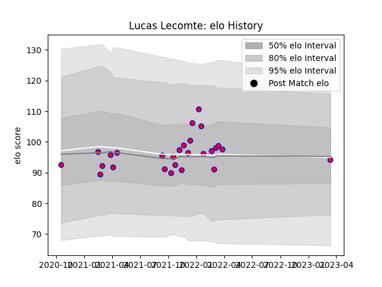

---  
layout: page  
title: Lucas Lecomte  
date: 2023-03-16 11:29:45.970014  
categories: player  
---
# Lucas Lecomte

## Positions: L, FL

## Current elo: 94.0

## Current Percentile: None

# Elo History

# Match History

| Team    |   Appearances |   Win Rate |
|:--------|--------------:|-----------:|
| Blagnac |            27 |   0.481481 |

| Opponent                   |   Matches |   Win Rate |
|:---------------------------|----------:|-----------:|
| Albi                       |         3 |   0.333333 |
| Aubenas                    |         3 |   0.666667 |
| Chambery                   |         3 |   0.666667 |
| Suresnes                   |         3 |   0.666667 |
| Cognac Saint Jean d'Angély |         2 |   0        |
| Narbonne                   |         2 |   0        |
| Nice                       |         2 |   0.5      |
| Tarbes                     |         2 |   0.5      |
| Valence Romans Drome Rugby |         2 |   0.5      |
| Bourgoin-Jallieu           |         1 |   1        |
| Dijon                      |         1 |   1        |
| Massy                      |         1 |   0        |
| Rennes                     |         1 |   1        |
| Soyaux-Angouleme           |         1 |   0        |