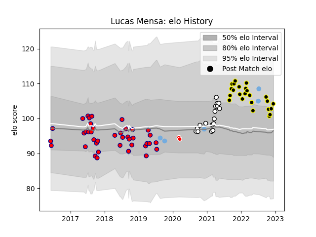

---  
layout: page  
title: Lucas Mensa  
date: 2022-12-14 11:33:40.420549  
categories: player  
---
# Lucas Mensa

## Positions: C

## Country: Argentina

## Current elo: 104.0

## Current Percentile: 72.0

# Elo History

# Match History

| Team                       |   Appearances |   Win Rate |
|:---------------------------|--------------:|-----------:|
| Pucara                     |            40 |   0.5625   |
| Mont-de-Marsan             |            24 |   0.666667 |
| Valence Romans Drome Rugby |            17 |   0.382353 |
| Argentina                  |             5 |   0.4      |
| Ceibos Rugby               |             2 |   1        |

| Opponent             |   Matches |   Win Rate |
|:---------------------|----------:|-----------:|
| SIC                  |         6 |   0.5      |
| Newman               |         6 |   0.833333 |
| Grenoble             |         5 |   0.4      |
| Colomiers            |         5 |   0.6      |
| Hindu                |         5 |   0.4      |
| Belgrano             |         4 |   0.5      |
| Agen                 |         3 |   0.666667 |
| San Luis             |         3 |   0.333333 |
| Regatas Bella Vista  |         3 |   1        |
| Oyonnax              |         3 |   0.333333 |
| Nevers               |         3 |   0.666667 |
| Alumni               |         3 |   0.166667 |
| La Plata             |         3 |   0.666667 |
| Montauban            |         3 |   0.333333 |
| Vannes               |         3 |   0.666667 |
| CUBA                 |         3 |   0.333333 |
| Mont-de-Marsan       |         2 |   0.25     |
| Carcassonne          |         2 |   1        |
| CASI                 |         2 |   0.5      |
| Aurillac             |         2 |   0.5      |
| Rouen                |         2 |   1        |
| Provence Rugby       |         1 |   0        |
| US Bressane          |         1 |   1        |
| Soyaux-Angouleme     |         1 |   1        |
| South Africa         |         1 |   0        |
| Selknam              |         1 |   1        |
| Atlético del Rosario |         1 |   1        |
| Bayonne              |         1 |   1        |
| Georgia              |         1 |   1        |
| Portugal             |         1 |   1        |
| England              |         1 |   0        |
| Biarritz Olympique   |         1 |   0        |
| Olimpia Lions        |         1 |   1        |
| New Zealand          |         1 |   0        |
| Narbonne             |         1 |   1        |
| Massy                |         1 |   0        |
| Lomas                |         1 |   1        |
| Perpignan            |         1 |   0        |