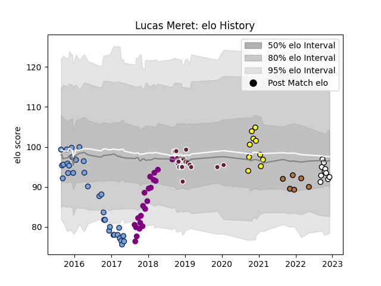

---  
layout: page  
title: Lucas Meret  
date: 2023-01-15 11:49:42.802689  
categories: player  
---
# Lucas Meret

## Positions: FH

## Current elo: 88.0

## Current Percentile: 15.0

# Elo History

# Match History

| Team                       |   Appearances |   Win Rate |
|:---------------------------|--------------:|-----------:|
| Bayonne                    |            36 |   0.416667 |
| Soyaux-Angouleme           |            29 |   0.5      |
| Bordeaux Begles            |            21 |   0.5      |
| Carcassonne                |            21 |   0.571429 |
| Narbonne                   |            17 |   0.235294 |
| Valence Romans Drome Rugby |            12 |   0.625    |

| Opponent                   |   Matches |   Win Rate |
|:---------------------------|----------:|-----------:|
| Perpignan                  |         8 |   0.5      |
| Mont-de-Marsan             |         7 |   0.285714 |
| Montauban                  |         7 |   0.428571 |
| Beziers                    |         6 |   0.666667 |
| Grenoble                   |         6 |   0.416667 |
| Carcassonne                |         5 |   0.4      |
| Vannes                     |         5 |   0.3      |
| Colomiers                  |         5 |   0.5      |
| Rouen                      |         4 |   0.75     |
| Narbonne                   |         4 |   0.75     |
| Dax                        |         4 |   0.25     |
| Agen                       |         4 |   0.5      |
| Biarritz Olympique         |         4 |   0.75     |
| Oyonnax                    |         3 |   0        |
| Clermont Auvergne          |         3 |   0.666667 |
| Aurillac                   |         3 |   0.666667 |
| Bourgoin-Jallieu           |         3 |   0.833333 |
| Bayonne                    |         3 |   0.333333 |
| Lyon                       |         3 |   0.333333 |
| Provence Rugby             |         3 |   0.666667 |
| Pau                        |         3 |   0.166667 |
| Nevers                     |         3 |   0.666667 |
| US Bressane                |         2 |   0        |
| Tarbes                     |         2 |   0.5      |
| Stade Toulousain           |         2 |   0        |
| Sale Sharks                |         2 |   0.5      |
| Benetton Treviso           |         2 |   0        |
| Wasps                      |         2 |   1        |
| Montpellier Herault        |         2 |   0        |
| Gloucester Rugby           |         2 |   0        |
| Blagnac                    |         2 |   0.5      |
| Albi                       |         2 |   1        |
| Massy                      |         2 |   0.5      |
| Brive                      |         2 |   0.5      |
| La Rochelle                |         2 |   0        |
| Connacht                   |         2 |   0        |
| Cognac Saint Jean d'Angély |         1 |   1        |
| Valence Romans Drome Rugby |         1 |   0        |
| Toulon                     |         1 |   1        |
| Suresnes                   |         1 |   1        |
| Soyaux-Angouleme           |         1 |   1        |
| Stade Francais Paris       |         1 |   0        |
| Nice                       |         1 |   1        |
| Bordeaux Begles            |         1 |   1        |
| Rennes                     |         1 |   1        |
| Racing 92                  |         1 |   0        |
| Chambery                   |         1 |   0        |
| Carqueiranne-Hyères        |         1 |   1        |