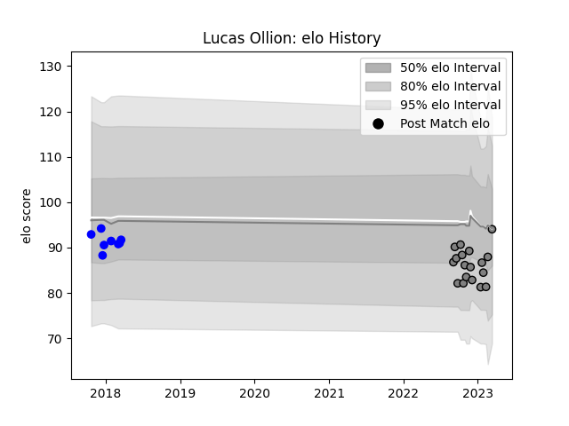

---  
layout: page  
title: Lucas Ollion  
date: 2023-02-02 18:52:15.790612  
categories: player  
---
# Lucas Ollion

## Positions: SH, FH

## Current elo: 91.0

## Current Percentile: 50.0

# Elo History

# Match History

| Team   |   Appearances |   Win Rate |
|:-------|--------------:|-----------:|
| Rennes |            16 |      0.125 |
| Vannes |             8 |      0.5   |

| Opponent                   |   Matches |   Win Rate |
|:---------------------------|----------:|-----------:|
| Albi                       |         2 |          0 |
| Suresnes                   |         2 |          0 |
| Tarbes                     |         2 |          0 |
| Valence Romans Drome Rugby |         2 |          0 |
| Biarritz Olympique         |         1 |          0 |
| Blagnac                    |         1 |          0 |
| Carqueiranne-Hyères        |         1 |          1 |
| Chambery                   |         1 |          0 |
| Cognac Saint Jean d'Angély |         1 |          1 |
| Colomiers                  |         1 |          1 |
| Aurillac                   |         1 |          1 |
| Grenoble                   |         1 |          0 |
| Mont-de-Marsan             |         1 |          1 |
| Montauban                  |         1 |          0 |
| Narbonne                   |         1 |          0 |
| Nice                       |         1 |          0 |
| Beziers                    |         1 |          1 |
| Bayonne                    |         1 |          0 |
| US Bressane                |         1 |          0 |
| Dax                        |         1 |          0 |