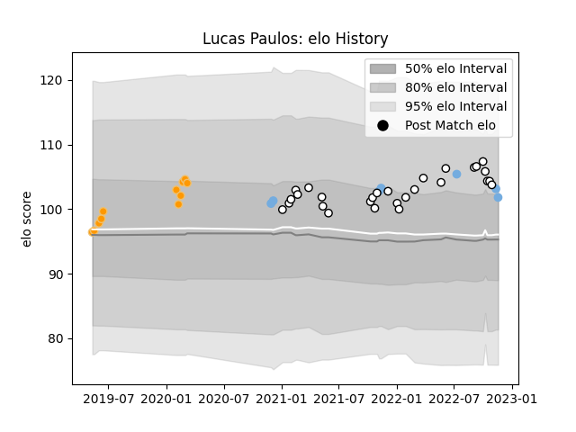

---  
layout: page  
title: Lucas Paulos  
date: 2022-11-22 11:33:50.613929  
categories: player  
---
# Lucas Paulos

## Positions: L

## Country: Argentina

## Current elo: 102.0

## Current Percentile: 77.0

# Elo History

# Match History

| Team      |   Appearances |   Win Rate |
|:----------|--------------:|-----------:|
| Brive     |            28 |   0.392857 |
| Jaguares  |            11 |   0.636364 |
| Argentina |             7 |   0.214286 |

| Opponent             |   Matches |   Win Rate |
|:---------------------|----------:|-----------:|
| Toulon               |         4 |   0.5      |
| Stade Francais Paris |         4 |   0.25     |
| Castres Olympique    |         3 |   0.333333 |
| Lyon                 |         2 |   0        |
| Scotland             |         2 |   0        |
| Bayonne              |         2 |   0.5      |
| Biarritz Olympique   |         2 |   0.5      |
| Bordeaux Begles      |         2 |   0.5      |
| Pau                  |         2 |   0.5      |
| Queensland Reds      |         2 |   1        |
| Hurricanes           |         2 |   0.5      |
| Stade Toulousain     |         2 |   0        |
| La Rochelle          |         2 |   0.5      |
| Sharks               |         2 |   0.5      |
| Stormers             |         1 |   0        |
| Sunwolves            |         1 |   1        |
| Racing 92            |         1 |   0        |
| Agen                 |         1 |   1        |
| Perpignan            |         1 |   1        |
| New Zealand          |         1 |   0        |
| Australia            |         1 |   0.5      |
| Lions                |         1 |   1        |
| Italy                |         1 |   1        |
| Highlanders          |         1 |   0        |
| France               |         1 |   0        |
| Bulls                |         1 |   1        |
| Wales                |         1 |   0        |