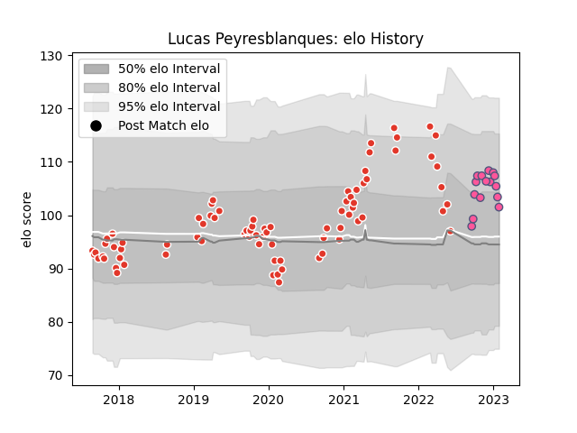

---  
layout: page  
title: Lucas Peyresblanques  
date: 2023-02-02 19:02:43.130669  
categories: player  
---
# Lucas Peyresblanques

## Positions: H

## Current elo: 102.0

## Current Percentile: 76.0

# Elo History

# Match History

| Team                 |   Appearances |   Win Rate |
|:---------------------|--------------:|-----------:|
| Biarritz Olympique   |            78 |   0.564103 |
| Stade Francais Paris |            15 |   0.5      |

| Opponent                   |   Matches |   Win Rate |
|:---------------------------|----------:|-----------:|
| Perpignan                  |         8 |   0.375    |
| Soyaux-Angouleme           |         6 |   0.666667 |
| Carcassonne                |         6 |   0.5      |
| Nevers                     |         6 |   0.333333 |
| Montauban                  |         5 |   0.6      |
| Beziers                    |         5 |   0.8      |
| Colomiers                  |         5 |   0.6      |
| Oyonnax                    |         5 |   0.6      |
| Grenoble                   |         5 |   0.7      |
| Mont-de-Marsan             |         3 |   0.5      |
| Rouen                      |         3 |   1        |
| Pau                        |         3 |   0.666667 |
| Bayonne                    |         3 |   1        |
| Vannes                     |         3 |   0.666667 |
| Racing 92                  |         2 |   0.5      |
| Stade Toulousain           |         2 |   0.25     |
| Montpellier Herault        |         2 |   0        |
| Lions                      |         2 |   0.5      |
| Dax                        |         2 |   0.5      |
| Castres Olympique          |         2 |   0.5      |
| Lyon                       |         2 |   0        |
| Bordeaux Begles            |         2 |   0.5      |
| Toulon                     |         2 |   0        |
| Benetton Treviso           |         2 |   0.5      |
| Valence Romans Drome Rugby |         1 |   1        |
| US Bressane                |         1 |   0        |
| Massy                      |         1 |   1        |
| Roval Drome XV             |         1 |   1        |
| Provence Rugby             |         1 |   1        |
| Clermont Auvergne          |         1 |   0        |
| Aurillac                   |         1 |   1        |