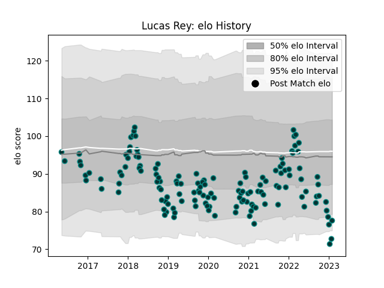

---  
layout: page  
title: Lucas Rey  
date: 2023-02-02 19:03:26.555629  
categories: player  
---
# Lucas Rey

## Positions: H

## Current elo: 78.0

## Current Percentile: 3.0

# Elo History

# Match History

| Team   |   Appearances |   Win Rate |
|:-------|--------------:|-----------:|
| Pau    |           140 |   0.389286 |

| Opponent             |   Matches |   Win Rate |
|:---------------------|----------:|-----------:|
| Clermont Auvergne    |        11 |  0.181818  |
| Montpellier Herault  |        10 |  0.4       |
| Stade Francais Paris |        10 |  0.5       |
| Castres Olympique    |        10 |  0.2       |
| Lyon                 |         9 |  0.277778  |
| Racing 92            |         9 |  0.222222  |
| Toulon               |         9 |  0.0555556 |
| La Rochelle          |         8 |  0.125     |
| Agen                 |         8 |  0.875     |
| Stade Toulousain     |         8 |  0.25      |
| Brive                |         8 |  0.5       |
| Bordeaux Begles      |         6 |  0.333333  |
| Perpignan            |         4 |  1         |
| Bayonne              |         4 |  0.875     |
| Cardiff Blues        |         4 |  0         |
| Worcester Warriors   |         3 |  0.666667  |
| Oyonnax              |         2 |  1         |
| Zebre                |         2 |  1         |
| Gloucester Rugby     |         2 |  1         |
| Cheetahs             |         2 |  0         |
| Calvisano            |         2 |  1         |
| Bristol Rugby        |         2 |  0         |
| Biarritz Olympique   |         2 |  1         |
| Leicester Tigers     |         1 |  0         |
| Ospreys              |         1 |  0         |
| Bath Rugby           |         1 |  0         |
| Edinburgh            |         1 |  0         |
| Grenoble             |         1 |  1         |