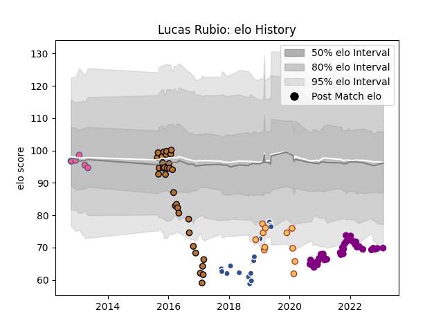

---  
layout: page  
title: Lucas Rubio  
date: 2023-02-04 18:31:37.080797  
categories: player  
---
# Lucas Rubio

## Positions: SH

## Country: Spain

## Current elo: 70.0

## Current Percentile: 5.0

# Elo History

# Match History

| Team                 |   Appearances |   Win Rate |
|:---------------------|--------------:|-----------:|
| Soyaux-Angouleme     |            48 |   0.416667 |
| Narbonne             |            32 |   0.375    |
| Agen                 |            22 |   0.204545 |
| Spain                |            11 |   0.727273 |
| Stade Francais Paris |             6 |   0.666667 |

| Opponent                   |   Matches |   Win Rate |
|:---------------------------|----------:|-----------:|
| Grenoble                   |         6 |   0.583333 |
| Albi                       |         5 |   0.6      |
| Perpignan                  |         5 |   0.2      |
| Beziers                    |         4 |   0.25     |
| Tarbes                     |         4 |   0.5      |
| Bourgoin-Jallieu           |         4 |   0.75     |
| Biarritz Olympique         |         4 |   0.25     |
| Dax                        |         4 |   0.5      |
| Aurillac                   |         4 |   0.75     |
| Lyon                       |         3 |   0.333333 |
| Mont-de-Marsan             |         3 |   0.333333 |
| Provence Rugby             |         3 |   0.333333 |
| Carcassonne                |         3 |   0.333333 |
| Racing 92                  |         3 |   0        |
| Massy                      |         3 |   0.333333 |
| Valence Romans Drome Rugby |         3 |   0.666667 |
| Montauban                  |         3 |   0        |
| Colomiers                  |         3 |   0        |
| Georgia                    |         2 |   0        |
| Nice                       |         2 |   0.5      |
| Russia                     |         2 |   1        |
| Nevers                     |         2 |   0        |
| Oyonnax                    |         2 |   0        |
| Pau                        |         2 |   0        |
| London Welsh               |         2 |   1        |
| Romania                    |         2 |   0.5      |
| Suresnes                   |         2 |   1        |
| Rouen                      |         2 |   0        |
| Toulon                     |         2 |   0        |
| Cognac Saint Jean d'Angély |         2 |   1        |
| Chambery                   |         2 |   0        |
| Castres Olympique          |         2 |   0.5      |
| Blagnac                    |         2 |   1        |
| Benetton Treviso           |         2 |   0.5      |
| Belgium                    |         2 |   1        |
| Bayonne                    |         2 |   0        |
| Aubenas                    |         2 |   1        |
| Stade Toulousain           |         1 |   0        |
| Stade Francais Paris       |         1 |   0        |
| Vannes                     |         1 |   0        |
| Agen                       |         1 |   0        |
| La Rochelle                |         1 |   0        |
| Namibia                    |         1 |   1        |
| Montpellier Herault        |         1 |   0        |
| Hong Kong                  |         1 |   1        |
| Harlequins                 |         1 |   0        |
| Germany                    |         1 |   1        |
| Dijon                      |         1 |   0        |
| Clermont Auvergne          |         1 |   0        |
| Cavalieri Prato            |         1 |   1        |
| Zebre                      |         1 |   0        |