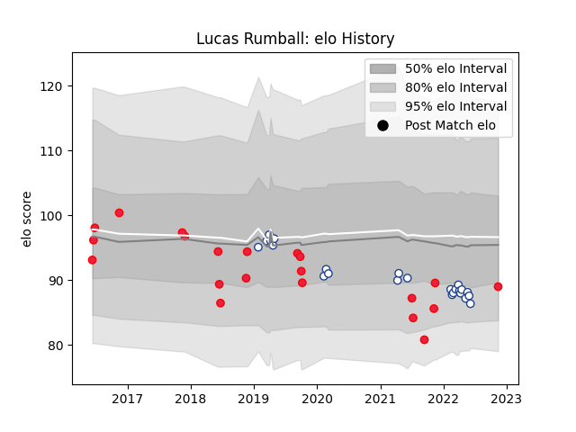

---  
layout: page  
title: Lucas Rumball  
date: 2022-11-16 11:34:32.675572  
categories: player  
---
# Lucas Rumball

## Positions: FL

## Country: Canada

## Current elo: 89.0

## Current Percentile: 14.0

# Elo History

# Match History

| Team           |   Appearances |   Win Rate |
|:---------------|--------------:|-----------:|
| Toronto Arrows |            24 |   0.5      |
| Canada         |            21 |   0.238095 |

| Opponent                 |   Matches |   Win Rate |
|:-------------------------|----------:|-----------:|
| NOLA Gold                |         4 |   0.5      |
| Old Glory DC             |         3 |   0.666667 |
| United States of America |         3 |   0        |
| Seattle Seawolves        |         3 |   1        |
| R.U. New York            |         3 |   0.333333 |
| Russia                   |         2 |   0.5      |
| Rugby ATL                |         2 |   0        |
| Italy                    |         2 |   0        |
| L. A. Giltinis           |         2 |   0        |
| New England Free Jacks   |         2 |   0.5      |
| Austin Herd              |         1 |   1        |
| Utah Warriors            |         1 |   1        |
| South Africa             |         1 |   0        |
| Scotland                 |         1 |   0        |
| San Diego Legion         |         1 |   0        |
| Portugal                 |         1 |   0        |
| Netherlands              |         1 |   1        |
| New Zealand              |         1 |   0        |
| Belgium                  |         1 |   1        |
| Japan                    |         1 |   0        |
| Ireland                  |         1 |   0        |
| Houston SaberCats        |         1 |   1        |
| Hong Kong                |         1 |   1        |
| Germany                  |         1 |   1        |
| Georgia                  |         1 |   0        |
| Fiji                     |         1 |   0        |
| England                  |         1 |   0        |
| Colorado Raptors         |         1 |   0        |
| Wales                    |         1 |   0        |