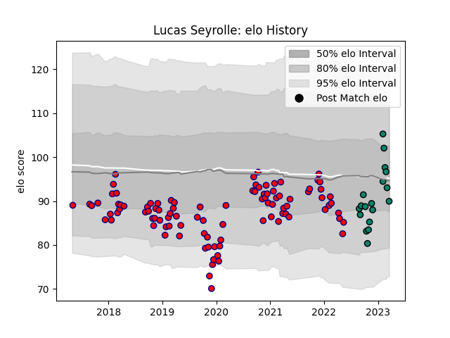

---  
layout: page  
title: Lucas Seyrolle  
date: 2023-03-21 18:28:31.041990  
categories: player  
---
# Lucas Seyrolle

Last updated: 2023-03-21
## Positions: P

## Current elo: 90.0

## Current Percentile: 42.0

# Elo History

# Match History

| Team      |   Appearances |   Win Rate |
|:----------|--------------:|-----------:|
| Aurillac  |            98 |   0.408163 |
| Montauban |            18 |   0.416667 |

| Opponent                   |   Matches |   Win Rate |
|:---------------------------|----------:|-----------:|
| Mont-de-Marsan             |        11 |   0.363636 |
| Vannes                     |        10 |   0.25     |
| Colomiers                  |         9 |   0.666667 |
| Beziers                    |         8 |   0.375    |
| Biarritz Olympique         |         8 |   0.125    |
| Grenoble                   |         7 |   0.285714 |
| Carcassonne                |         7 |   0.285714 |
| Soyaux-Angouleme           |         6 |   0.333333 |
| Oyonnax                    |         6 |   0.5      |
| Montauban                  |         6 |   0.25     |
| Nevers                     |         5 |   0.4      |
| Perpignan                  |         5 |   0.1      |
| Provence Rugby             |         5 |   0.6      |
| Massy                      |         4 |   1        |
| Rouen                      |         4 |   0.75     |
| Bayonne                    |         3 |   0.333333 |
| Narbonne                   |         2 |   1        |
| Brive                      |         2 |   0.5      |
| US Bressane                |         2 |   0.5      |
| Valence Romans Drome Rugby |         2 |   0.5      |
| Dax                        |         1 |   1        |
| Aurillac                   |         1 |   0        |
| Roval Drome XV             |         1 |   0        |
| Agen                       |         1 |   1        |